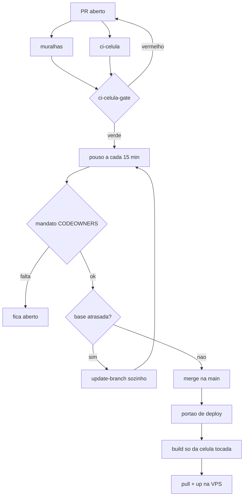
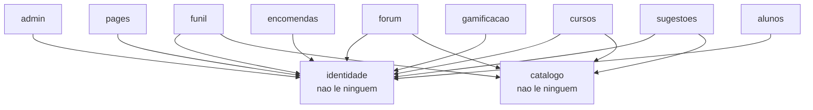

# Como o site funciona hoje

> Medido em 19/09/2026 contra `origin/main = d56ceb68`. Este documento é uma
> fotografia: cada número aqui saiu de um comando, não de memória. Ele não é
> recalculado sozinho, então trate a data acima como validade. Onde ele
> divergir do código, do `CONSTITUICAO.md` ou do `RITOS.md`, o original vence.

Um site no ar, meshcraft.top, servido por 18 células independentes atrás de um
único gateway, com 285 endereços mapeados. Toda mudança entra por PR, é medida
por portões automáticos, integra sem gesto humano e vira imagem nova só da
célula tocada. Em 19/09/2026 entraram 41 merges, e três deles consertaram
coisas que estavam quebradas há semanas.

## O que está no ar

Um site, `meshcraft.top`, ativo, com uma oferta padrão (`curso-teste`, 990
centavos) e três idiomas: pt-br como padrão, inglês, e espanhol ainda sem
indexação. Site que não está em `infra/sites.json` nunca é tocado, e o catálogo
de produção converge para esse arquivo a cada merge que o altera.

O site é servido por **18 células** independentes: `admin`, `alunos`,
`catalogo`, `checkout`, `cursos`, `encomendas`, `forum`, `funil`,
`gamificacao`, `identidade`, `leads`, `mensageria`, `metricas`, `notificacoes`,
`pagamentos`, `pages`, `quiz` e `sugestoes`. Cada uma é um serviço próprio, com
banco próprio e imagem própria, e várias têm companheiros de fundo:
`-consumer` para eventos, `-relay` para a caixa de saída, `-huey` para tarefas
agendadas, `-tique` para o relógio das encomendas.

Na frente de todas está um gateway único, o Traefik, e atrás delas um Postgres
e um Redis compartilhados. Nada mais fala com a internet.

### Os endereços

O mapa declarado em `painel/mapa-do-site.json` tem **285 endereços**: 270
públicos e 15 internos. A distribuição diz onde está o peso do sistema:

| célula | endereços | o que ela é |
| --- | --- | --- |
| admin | 136 | a área fechada do dono, incluindo o painel e a gestão da Caixa |
| sugestoes | 25 | a caixa de sugestões e a moderação |
| cursos | 20 | a sala de aula |
| forum | 18 | a comunidade |
| funil | 16 | a porta de entrada pública, a oferta e o cadastro |
| pages | 15 | as páginas do site e o portfólio |
| as outras 12 | 55 | checkout, identidade, encomendas, gamificação e o resto |

Quase metade dos endereços é da `admin`, e isso é esperado: é onde mora o
painel, o livro de ocorrências e a operação. A porta pública de verdade é
estreita, e cabe em uma linha: `/` leva à oferta, `/cadastro` guarda o contato,
`/login` entra, e `/healthz` responde se o site está vivo.

## De um PR até o ar

Nenhum humano aperta botão nesse caminho. O `pouso.yml` roda de 15 em 15
minutos, e também a cada evento de PR, e chama `ci/mergear.py --automatico`,
que integra sozinho tudo o que passou nos portões. São 25 workflows no total.

### O que cada portão mede

| portão | o que ele impede |
| --- | --- |
| `muralhas` | lei da casa quebrada: travessão em texto publicado, mapa de células mentindo, registro faltando no livro |
| `ci-celula` | testes da célula que o diff tocou, derivados de `celulas.yml`, não do tamanho do PR |
| `ci-celula-gate` | a tabela final: célula tocada sem teste verde não passa |
| `conferir o toca declarado` | PR que mexe em célula que não declarou |
| `painel-no-navegador` | painel gerado que não bate com o livro de ocorrências |
| mandato do mantenedor | qualquer caminho do CODEOWNERS sem a palavra do dono na descrição |

O mandato é a única coisa nesse caminho que espera por uma pessoa. Caminhos
como `ci/`, `infra/`, `contracts/`, `services/pagamentos/`,
`services/checkout/`, `.github/` e os arquivos de lei da raiz são do
mantenedor: um PR que os toca só integra com uma linha
`Mandato-do-mantenedor:` na descrição, nomeando o pedido e os caminhos
autorizados.

### O deploy é por célula, e não tem botão

`deploy-celula.yml` não aceita disparo manual, de propósito: ele só reage a
push na `main` que toque `services/`, `painel/`, `fila/`, `documentos/` ou
`docs/decisoes/`. Entrega que ninguém amarrou a commit revisado não existe
aqui.

Antes de qualquer build, `ci/portao_de_deploy.py` prova que o PR de origem
estava verde. Só então a imagem da célula tocada é construída e só ela sobe na
VPS. Um registro novo no livro também dispara deploy, porque `painel/` entra na
imagem da `admin`: sem isso o painel online congelaria em silêncio.

## Quem depende de quem

Três células sustentam quase tudo: `identidade` (lida por 9), `catalogo` (por
8) e `alunos` (por 7). As três estão declaradas em `celulas.yml`, e um varredor
(`ci/mapa_de_celulas.py --verificar`) reprova o PR nos dois sentidos: consumo
que existe no código e não foi declarado, e declaração que não existe no
código. O mapa não envelhece em silêncio.

### A tabela inteira

| célula | lê de |
| --- | --- |
| admin | alunos, catalogo, cursos, encomendas, gamificacao, identidade, mensageria, metricas, notificacoes, sugestoes |
| funil | alunos, catalogo, gamificacao, identidade, leads, notificacoes |
| forum | alunos, catalogo, gamificacao, identidade |
| pages | admin, alunos, catalogo, identidade |
| sugestoes | alunos, catalogo, identidade, notificacoes |
| cursos | alunos, catalogo, identidade |
| gamificacao | catalogo, forum, identidade |
| encomendas | alunos, identidade |
| checkout | catalogo, pagamentos |
| alunos | identidade |
| catalogo, identidade, leads, mensageria, metricas, notificacoes, pagamentos, quiz | ninguém |

### Duas coisas que essa tabela revela

**Há um ciclo.** `forum` lê `gamificacao` e `gamificacao` lê `forum`. É o único
par assim no sistema, e significa que nenhuma das duas pode ser publicada antes
da outra por ordem de dependência: se as duas mudarem juntas, a ordem de subida
é arbitrária. Não está quebrado hoje, e vale saber que está lá.

**A `admin` é a mais acoplada**, com 10 leituras. É coerente com ela ter 136
dos 285 endereços: é a tela que mostra o resto do sistema. Em troca, ela é a
célula que mais sente qualquer contrato que mude.

## Como se volta atrás

A resposta canônica a qualquer emergência é o `rollback.yml`, e ele é o único
dos três caminhos de entrega que aceita disparo manual. A razão está escrita no
próprio arquivo: os deploys **entregam** código e por isso precisam de commit
revisado; este só **anda para trás**.

São três informações: a célula (uma só), o alvo (o sha completo de um commit da
`main`, ou a palavra `main` para desfazer o pino) e o motivo, que vai para o log
como trilha de auditoria.

### O que ele prova antes de tocar no servidor

Antes de qualquer SSH, `ci/rollback.py` exige as três: que a célula esteja
declarada no manifesto, que o commit seja **ancestral da main** (ou seja, que
já passou pelo portão de deploy), e que a imagem exista no registry. Fora disso
o job de aplicar é pulado, porque não medir nunca vira verde.

O run tem três jobs, e os três precisam ficar verdes:

1. `validar-alvo`, que faz as três provas acima e nunca recebe a chave SSH
2. `aplicar-na-vps`, que só declara sucesso se a saída da VPS trouxer a marca
   `REVERSAO-CONCLUIDA:`
3. `congelar-ou-descongelar`, que segura a célula no alvo antigo ou a devolve à
   linha principal

### O pino não persiste, de propósito

A variável `<CELULA>_TAG` é exportada só para aquele `up`. O próximo deploy da
célula volta para `:main` sozinho. O rollback segura o fogo; quem apaga é o PR
com a correção.

### Ela estava morta, e agora está provada

O job `aplicar-na-vps` **não rodava desde 24/08/2026**. Em 28/08 o workflow
ganhou um parâmetro novo sem `actions/checkout`, e a válvula quebrou em
silêncio: nenhum run vermelho acusava, porque ninguém dispara um rollback sem
incêndio. Foram 22 dias com a saída de emergência trancada.

Hoje ela tem duas provas ao vivo na `main`: o run `35420310877`, que consertou
e provou, e o run `35450057117`, rodado sobre a chave nova, com
`aplicar-na-vps` e `congelar-ou-descongelar` verdes e o descongelamento
executado.

## O que mudou em 19/09/2026

**34 PRs integrados, 24 fechados sem integrar, e os abertos caíram de 50 para
20.** Medido às 15:31 UTC. Os que mudaram como o sistema se comporta, do mais
recente para o mais antigo:

| hora (BRT) | PR | o que destravou |
| --- | --- | --- |
| 12:15 | #1765 | o fecho da rotação da chave e da válvula entra no livro |
| 11:46 | #1738 | 17 jobs em 16 workflows amarrados a `environment: vps`, tirando a chave SSH do nível do repositório |
| 11:15 | #1244 | o DNS do meshcraft.top mora na Hostinger, não no Cloudflare: o projeto mandava procurar no lugar errado |
| 09:57 | #1764 | a trava contra sub-agente de escrita, com a régua lida da própria ficha em vez de lista fixa de nomes |
| 09:14 | #1763 | o lote de encerramento e as cinco tarefas dos guardas furados |
| 09:10 | #1618 | veredito e medição de esforço param de se contaminar |
| 09:06 | #1610 | o censo de leis não encolhe mais em silêncio |
| 09:03 | #1622 | a fila recusa tarefa sem responsabilidade e cadastro ambíguo |
| 08:15 | #1757 | a história do conselho volta a ter origem registrada |
| 08:00 | #1613 | porta única para abrir conversa no fórum |
| 01:13 | #1762 | a válvula de emergência provada viva na main |
| 01:09 | #1761 | a régua e o embarcado viram a mesma coisa |
| 00:56 | #1759 | a válvula de emergência consertada |
| 00:39 | #1760 | a capa do painel passa a ser função só do que está aberto |
| 00:18 | #1758 | a capa deixa de carregar afirmações velhas sem prova |

### Os três defeitos graves que morreram

**A válvula de emergência estava morta há 22 dias** (#1759, #1762). Contada na
seção anterior.

**A capa do painel estava a 67 bytes de parar a fábrica** (#1758, #1760). O
resumo embarcado pesava 153.533 de 153.600 bytes permitidos, e todo PR com
recibo reprovava em três checks. Agora o tamanho é função do que está
**aberto**, nunca do total histórico: de 100 para 1.000 registros fechados a
diferença é de 3 ou 4 bytes, que são os algarismos das contagens.

**A régua media coisa diferente do que embarcava** (#1761). O portão media
`resumo.registros` e o painel embarcava `resumo` inteiro. Foi por essa fresta
que um furo passou verde. Hoje é um objeto só.

### O que mudou fora do Git

Quatro coisas foram feitas à mão no GitHub e na VPS, e só existem como estado,
não como commit:

- a chave de deploy foi **rotacionada**: par novo gerado, pública instalada no
  usuário `deploy`, privada guardada no Environment, cópia cifrada conferida e
  a privada sem senha removida da máquina local
- o **Environment `vps` foi criado** e restrito a branch protegida, com a
  `main` sendo a usada pelos runs
- o segredo antigo `DEPLOY_SSH_KEY` **saiu do nível do repositório**, que ficou
  só com `PISTA_TOKEN` e `VPS_HOST`
- `COMERCIAIS_DO_CRM` e `TOKENS_DA_GALERIA_GAMIFICACAO` foram gravadas na VPS,
  e `leads`, `forum`, `gamificacao` e `gamificacao-consumer` terminaram
  saudáveis

Nenhuma chave antiga foi removida do `authorized_keys`, de propósito:
comentário de chave não é prova de identidade.

## Os buracos conhecidos

Tudo aqui tem nome, e o que vira trabalho tem tarefa.

| buraco | tamanho | onde está |
| --- | --- | --- |
| 12 guardas de invariante não mordem | provado por mutação real | TAR-494 a TAR-498 |
| chaves antigas ainda abrem a porta da VPS | dono desconhecido | TAR-500 |
| `ci/radio.py` devolve 404 em todo boletim | pré-existente, não bloqueia | sem tarefa |
| `forum` e `gamificacao` se consomem | ordem de publicação arbitrária entre as duas | sem tarefa |
| `pagamentos` com zero tarefas na fila | esperando a compra real de cartão | critério do mantenedor |

### Os 12 guardas que não guardam nada

Uma varredura nos **101 testes de invariante** do projeto rodou em 19/09/2026,
em três fases: leitura, contestação adversária e mutação real em bancada
isolada.

O que está **provado por execução**: 12 guardas foram sabotados de verdade na
linha de produção que eles deveriam proteger, e **os 12 continuaram verdes**.
Cada um com linha de base verde antes, saída real do pytest depois, e
desfazimento por cópia de backup com a bancada conferida limpa. São 2 na
`admin`, 3 na `alunos`, 1 na `catalogo`, 4 na `checkout` e 2 na `cursos`, e
cada tarefa carrega a sabotagem exata para que o conserto possa provar vermelho
para verde contra ela.

O que **não** está provado: outros 92 guardas foram rebaixados de "morde" para
"incerto" porque um adversário por leitura achou uma sabotagem plausível em
cada um. A taxa foi de 95 em 95, e 100% é assinatura de instrumento enviesado,
não de realidade: o prompt do contestador manda achar uma sabotagem. Leia isso
como "não sabemos", nunca como "estão quebrados".

### A fila hoje

433 tarefas no total: 366 concluídas, 33 canceladas, 23 na fila, 9 em execução
e 1 bloqueada. A bloqueada (TAR-240) espera uma decisão do mantenedor sobre
desligar a varredura diária dos links do portfólio.

### O que anda sozinho a partir daqui

20 PRs seguem abertos e sob a automação de pouso, que roda de 15 em 15 minutos
e atualiza base atrasada por conta própria. Dois deles (#1504 e #1611) já têm o
mandato escrito e só esperam a vez na esteira.
