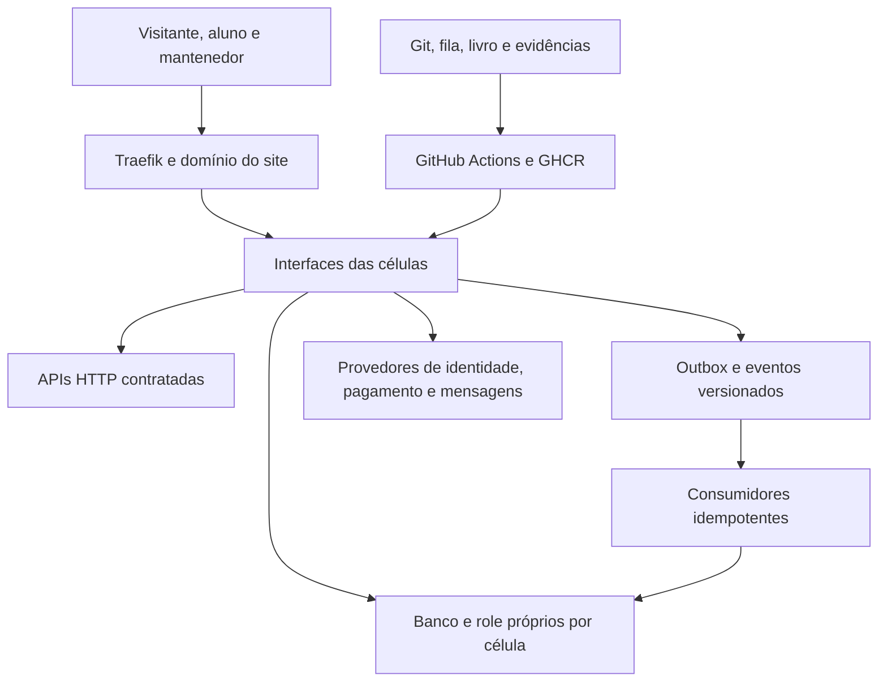
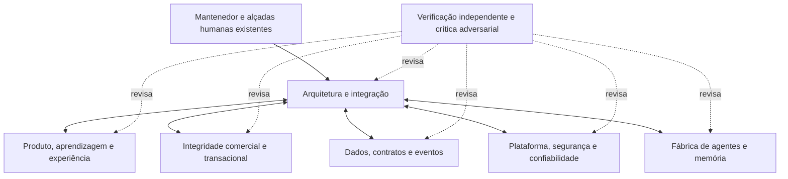

# Sistema e equipe especialista do sitesdoreino

Recorte: `origin/main` em `c1d42cff`, consultado em 18/09/2026, por volta de 20:27 UTC. Entrega da [TAR-455](../../../fila/tarefas/455-compreender-o-sistema-e-formar-a-equipe-especialista-do-proj.json). Este relatório reconstrói o sistema e propõe sua equipe especialista. Não altera leis, contratos, acesso, produção nem responsáveis humanos.

**Como ler:** FATO DO PROJETO indica algo presente nas fontes ou medido; INFERÊNCIA é interpretação apoiada nesses fatos; HIPÓTESE exige confirmação; PROPOSTA descreve o desenho novo. A classificação vale para o bloco identificado. Estado operacional é retrato datado, não segundo painel.

**Método e limite:** inventário do Git de 5.644 arquivos, leitura dirigida cobrindo os domínios, confronto entre manifestos, contratos, implementação, regras e operação. Não houve leitura linha a linha de todos os arquivos. Houve três frentes de investigação e integração dos achados, verificadores dos mapas e exame de divergências. Compra, matrícula, aula, recuperação de desastre e pontes locais não foram exercitadas de ponta a ponta. Existência de código ou testes não equivale a comprovação de produção.

## PARTE I: O que estamos construindo

**FATO DO PROJETO.** O sitesdoreino é uma plataforma multissítio que reúne aquisição de público, venda, acesso, ensino, comunidade, produção de portfólio e administração. Meshcraft, com a escola Roblox 3D, é uma realização desse sistema. Um novo site é registro no catálogo e associação de domínio, usando o mesmo conjunto de serviços, não uma cópia da infraestrutura. Fontes: [Constituição](../../../CONSTITUICAO.md), [manifesto de células](../../../celulas.yml), [mapa do site](../../../painel/mapa-do-site.json) e [constituições dos domínios](../../../constituicoes/).

**INFERÊNCIA.** O resultado pretendido é transformar interesse em aprendizado demonstrável e participação produtiva, com continuidade entre promessa da oferta, acesso adquirido, estudo e capacidade de produzir. A fábrica de software sustenta esse caminho com mudanças rastreáveis e recuperáveis. Confundir fábrica com produto esconde o aluno; olhar só o aluno esconde a operação que precisa mantê-lo atendido.

**FATO DO PROJETO.** Há três experiências. O visitante descobre a proposta, identifica-se, responde ao quiz ou deixa contato. O aluno recebe acesso por produto e site, percorre conteúdo publicado, registra progresso, envia trabalho e participa das áreas autorizadas. O mantenedor administra conteúdo, pessoas, vendas, decisões e a fila de evolução. Mensageria e notificações devolvem informações; métricas recebe fatos para apoiar decisões.

**INFERÊNCIA.** A unidade central do produto é a jornada da pessoa; a unidade de isolamento técnico é a célula; a unidade de mudança é uma tarefa rastreada, implementada em bancada e entregue com prova. Uma jornada cruza células, e um especialista pode revisar várias sem passar a ser dono dos seus bancos.

**FATO DO PROJETO.** Princípios explícitos: isolamento de execução/dados, contratos e eventos versionados, snapshots, idempotência, falha fechada nas decisões sensíveis, multissítio com `site_id`, rollback por célula, evidência falsificável e estado calculado de fatos. O Padrão de Trabalho exige resolver a experiência inteira e eliminar adições sem função. A autoridade continua em [CLAUDE.md](../../../CLAUDE.md), [CONSTITUICAO.md](../../../CONSTITUICAO.md), [RITOS.md](../../../RITOS.md) e constituições de célula.

**PROPOSTA.** Sete competências acionadas conforme o problema, com perguntas, entregáveis e limites, preservam os mecanismos existentes. Não criam outra fila, livro, hierarquia de marcas de IA ou substitutos dos responsáveis humanos.

## PARTE II: Mapa da arquitetura

### Camadas e fronteiras

**FATO DO PROJETO.** A borda usa Traefik para encaminhar caminhos públicos aos serviços. A aplicação é majoritariamente Python/Django, com Django Ninja nas APIs. Células têm contêineres e configuração próprios, comunicam-se por HTTP e eventos. PostgreSQL é separado por database e role de célula, sobre serviço compartilhado; Redis também é compartilhado. A fábrica usa Python, Git, GitHub Actions e GHCR; Node participa do painel. O Compose fixa Traefik 3.4, PostgreSQL 17 e Redis 7 no recorte. Fontes: [Compose](../../../infra/docker-compose.yml), [mapa técnico](../../../painel/ia/INDICE.md), [contratos](../../../contracts/) e [workflows](../../../.github/workflows/).

O diagrama resume relações, não uma única aplicação ou banco acessível por todas. Em texto: pessoa → borda → célula → dados próprios; integrações seguem contrato HTTP ou evento. Mudanças seguem tarefa → bancada → prova → PR → integração → publicação medida.

### Componentes e dependências declaradas

**FATO DO PROJETO.** São 18 células e 39 relações de consumo no manifesto. A última coluna reproduz os consumos declarados em `celulas.yml`; não enumera eventos ou infraestrutura. Célula sem consumo HTTP declarado ainda pode receber eventos ou consultar provedor externo.

| Célula | Responsabilidade no produto | Consome por HTTP, segundo o manifesto |
|---|---|---|
| admin | Administração, conteúdo, decisões e coordenação | alunos, catalogo, cursos, encomendas, gamificacao, identidade, mensageria, metricas, notificacoes, sugestoes |
| alunos | Matrículas, pré-matrículas e direito de acesso | identidade |
| catalogo | Sites, produtos, ofertas, preços e menus | nenhum |
| checkout | Compra, pedido e snapshot da oferta | catalogo, pagamentos |
| cursos | Aulas, progresso, checkpoints, laudos e plantões | alunos, catalogo, identidade |
| encomendas | Primeiro dólar, propostas, reservas e peças | alunos, identidade |
| forum | Tópicos, mensagens e moderação | alunos, catalogo, gamificacao, identidade |
| funil | Aquisição, captura e idiomas | alunos, catalogo, gamificacao, identidade, leads, notificacoes |
| gamificacao | Ledger de XP e Cristais, níveis e Forja | catalogo, forum, identidade |
| identidade | Autenticação Google/senha e sessão | nenhum |
| leads | Consentimento, origem e linha do tempo | nenhum |
| mensageria | E-mail, WhatsApp e jornadas | nenhum |
| metricas | Fatos, cobertura e mensagens rejeitadas | nenhum |
| notificacoes | Cartas, sino, dispositivos e push | nenhum |
| pagamentos | Intenções, ledger e Mercado Pago | nenhum |
| pages | Prancheta, curadoria, portfólio e estúdio | admin, alunos, catalogo, identidade |
| quiz | Pontuação e qualificação | nenhum |
| sugestoes | Propostas, votos, comentários e ChangeSpec | alunos, catalogo, identidade, notificacoes |

**FATO DO PROJETO.** Há 16 contratos OpenAPI congelados; funil e quiz aparecem como não aplicáveis no [manifesto de contratos](../../../ci/manifesto-de-contratos.json). Congelamento não significa que todo endpoint esteja implementado. A Parte VIII separa contrato, capacidade e metadados inconsistentes.

**FATO DO PROJETO.** API interna não recebe automaticamente exposição pública. Catálogo resolve o site; `site_id` acompanha entidades/eventos conforme contrato; host desconhecido deve falhar. Identidade autentica, alunos decide matrícula, cursos apresenta conteúdo autorizado. Serviço não importa comportamento nem acessa banco de outra célula. Revisão especialista não concede permissão para alterar pagamentos, contrato congelado ou CODEOWNERS.

### Fluxos centrais

**FATO DO PROJETO: compra e acesso.** Oferta no funil → checkout consulta catálogo e guarda snapshot → intenção de pagamento → webhook → consulta do status à API do provedor → evento aprovado → matrícula idempotente e atualizações dos consumidores, como checkout, leads e mensageria. Não se decide status apenas pelo corpo recebido. Fontes: [checkout](../../../services/checkout/apps/core/api.py), [webhook Pix](../../../services/pagamentos/pagamentos/methods/pix/webhook.py), [matrícula](../../../services/alunos/apps/matriculas/services.py). Ordem entre consumidores não deve ser presumida. Compra real não foi medida; ativar venda não pertence à entrega.

**FATO DO PROJETO: aprendizagem.** Sessão de identidade → cursos consulta alunos por produto/site → recusa quando não consegue provar autorização → aula publicada e progresso → checkpoint/envio → laudo humano → evento libera próxima etapa e alimenta gamificação. Fontes: [clientes](../../../services/cursos/apps/core/clients.py), [sessão](../../../services/cursos/apps/core/sessao.py), [views](../../../services/cursos/apps/core/views.py), [eventos](../../../services/cursos/apps/cursos/eventos.py). Progresso representa realização, não calendário; rascunho de IA não substitui avaliação humana.

**FATO DO PROJETO: comunidade e retorno.** Funil e quiz alimentam leads; fórum e sugestões geram efeitos na gamificação; pages reúne produção/portfólio; mensageria e notificações devolvem comunicações; métricas observa parte desses acontecimentos. Fontes: [handlers](../../../services/gamificacao/apps/gamificacao/handlers.py) e [consumidor de métricas](../../../services/metricas/apps/fatos/management/commands/consume_eventos.py). Cobertura parcial impede chamar o fluxo de instrumentação completa.

**FATO DO PROJETO: mudança do sistema.** Pedido → tarefa e brief → modelo/esforço → bancada → baseline → mudança/prova → `pr.py` valida revisão isolada e embarca recibo/eventos → checks no SHA → integração automática → publicação medida → resultado ou dívida. Fila registra trabalho; livro registra acontecimento; estado é calculado. Fontes: [fila](../../../fila/LEIA-ME.md), [livro](../../../painel/LEIA-ME.md), [sessão](../../../ci/sessao.py), [economia](../../../ci/economia_da_fabrica.py), [PR](../../../ci/pr.py) e [ritos](../../../RITOS.md).

### Inteligência artificial no produto e na fábrica

**FATO DO PROJETO.** Quatro módulos chamam Anthropic durante o uso do produto. No [fórum](../../../services/forum/apps/core/agente.py), a IA prepara resposta para moderador revisar/publicar; não cria mensagem por conta própria. O [assistente de laudo](../../../services/cursos/apps/cursos/agente.py) sugere campos para professora corrigir/assinar; não decide aprovação ou próxima aula. O [guardião de fidelidade](../../../services/cursos/apps/cursos/fidelidade.py) compara conteúdo derivado com fontes; não corrige, veta ou grava. O [analista administrativo](../../../services/admin/apps/core/analista.py) analisa dossiê sanitizado e propõe interpretação/próximo passo; não decide nem grava fatos sozinho.

No recorte, os quatro usam a família Haiku, com o identificador `claude-haiku-4-5-20251001` observado nas definições do modelo e referências compartilhadas. A chave é consultada no ponto de uso; há timeout, retry limitado e falha isolada do recurso, com tratamento em português. Sem chave, o recurso assistivo fica indisponível; isso não autoriza inferir falha da aplicação inteira. Nenhuma chamada paga foi feita nesta análise. Prompts, validação da resposta e alçada humana são partes do controle, não apenas a escolha do modelo.

Claude Code, Codex e Antigravity pertencem à fábrica de desenvolvimento no recorte, não à identidade de um professor, atendente ou serviço de decisão do produto. A [automação headless local](../../../fila/tarefas/431-o-painel-local-continua-trabalhando-sozinho.json) é continuidade de construção, distinta das quatro integrações assistivas. A equipe por competência não altera esses prompts/runtime.

### Administração local e ponte privada

**FATO DO PROJETO.** A direção aprovada é Admin operacional no localhost, com código reconstruível e pontes versionados, sem criar nova superfície administrativa pública. [TAR-419](../../../fila/tarefas/419-conectar-o-localhost-as-portas-privadas-da-vps-com-autentica.json) e [TAR-433](../../../fila/tarefas/433-a-porta-privada-pela-qual-o-painel-do-mantenedor-le-os-dados.json) descrevem a separação. A [entrada privada](../../../infra/traefik/dynamic/entrada-privada.yml) limita quatro operações GET em `127.0.0.1:8443`; o [provisionador](../../../infra/provisionar-usuario-ponte.sh) restringe a conta da ponte ao destino permitido. Metade versionada da ponte e desenho local existem; saúde, cliente final e conexão atual do PC à VPS NÃO FORAM MEDIDOS nesta sessão. A existência da rota administrativa do site ou seu login não revoga essa direção.

## PARTE III: Estado atual do sistema

### Existente e medido

**FATO DO PROJETO.** Existem células, contratos/eventos, manifestos, infraestrutura, fábrica de entrega, fila, livro e superfícies administrativas. É um sistema implementado em vários domínios; maturidade operacional de cada jornada exige prova própria.

| Medição desta sessão | Resultado e limite |
|---|---|
| `python ci/mapa_de_celulas.py --verificar` | PASS: 18 células, 39 consumos e caminhos conferidos |
| `python ci/mapa_do_site.py --verificar` | PASS: 273 entradas e 273 rotas; ressalva de 48 rotas sem veredito de método |
| GET `https://meshcraft.top/` | HTTP 200, título Meshcraft; prova da entrada, não das jornadas |
| GET `https://meshcraft.top/mapa-ia/` | HTTP 200 textual; não prova frescor de todo o mapa |
| GET `https://meshcraft.top/admin/documentos/` | Inicialmente redirecionou à autenticação; na continuação, o acesso autenticado ao editor foi confirmado. Documento desta entrega não foi criado ou relido |
| Livro local em `0365cf67` | Gerador e verificador externo aprovaram 1.566 registros em dois meses, antes do recibo desta entrega |

O Python inicial não tinha PyYAML; o primeiro ERROR não contou como prova. Medição dos mapas ocorreu após dependências temporárias isoladas, sem mudar o projeto. Números são retrato datado; o estado atual vem dos comandos, não de atualização manual deste relatório.

### Parcial, implícito e não comprovado

**FATO DO PROJETO.** Há endpoints 501 em leads/encomendas, regras de gamificação inicialmente inativas, cobertura limitada de métricas e consumidores que enviam falhas para DLQ. Capacidade ausente, ativação controlada e recuperação operacional são situações diferentes.

**FATO DO PROJETO.** Lei integrada permite integração automática sem atestado obrigatório ou etiqueta de pouso; fichas/vigilantes conservam trechos anteriores. PRs [1715](https://github.com/abundanciabr/sitesdoreino/pull/1715), [1716](https://github.com/abundanciabr/sitesdoreino/pull/1716), [1717](https://github.com/abundanciabr/sitesdoreino/pull/1717), [1718](https://github.com/abundanciabr/sitesdoreino/pull/1718) e [1719](https://github.com/abundanciabr/sitesdoreino/pull/1719) estavam abertos no recorte, incluindo proposta de retirar atribuições por marca e o Rádio. Trabalho em voo não é lei integrada; ranking é preocupação separada.

**INFERÊNCIA.** O risco transversal de coordenação é tratar instruções temporalmente incompatíveis como igualmente atuais. A equipe começa pela revisão e cadeia de autoridade, registra divergência e a encaminha; este relatório não legisla a transição.

**HIPÓTESE.** Jornadas podem ter maturidades operacionais distintas. Código, histórico e página acessível não demonstram conversão, satisfação, economia, capacidade ou recuperação integral. São necessários dados com origem/janela e exercícios autorizados.

**FATO DO PROJETO.** O histórico contém terminais TAR-419/TAR-433 para administração e ponte; saúde atual não foi medida. O conselho descrito na decisão da tríade está fora do Git e TAR-379 não tinha terminal no recorte. Inventário não é posse desses dados ou confirmação de sincronização.

**PROPOSTA.** Nasce aqui a equipe funcional, suas fichas acionáveis, crítica e núcleo de referência. Não nasce serviço de agentes sempre ligado. As investigações desta sessão foram execução real; continuidade só é declarada com executor e prova próprios.

## PARTE IV: Equipe especialista

**PROPOSTA.** Sete funções cobrem necessidades concretas sem criar cargos redundantes. Pessoa/agente pode exercer funções em momentos diferentes; autor e verificador independente da mesma entrega não se confundem. A atribuição técnica não altera CODEOWNERS nem alçadas de [responsabilidades.json](../../../painel/responsabilidades.json).

| Especialista | Missão | Domínio | Responsabilidades | Entregáveis | Interações |
|---|---|---|---|---|---|
| Arquitetura e integração | Coerência entre jornadas, células e mudanças | Fronteiras/dependências | Integrar pareceres e escopo | Impacto, brief e decisão proposta | Todos e crítica independente |
| Produto, aprendizagem e experiência | Jornada realiza a promessa da escola | Pessoas/conteúdo/UX | Resultados, estados e avaliação | Jornada, protótipo e aceite | Comercial, dados, plataforma, verificação |
| Integridade comercial e transacional | Coerência de oferta, dinheiro e acesso | Aquisição/venda | Snapshots e estados de cobrança | Matriz de estados e reconciliação | Produto, dados, plataforma, verificação |
| Dados, contratos e eventos | Semântica e evolução segura | APIs/eventos/dados | Ownership, idempotência e migração | Compatibilidade e recuperação | Produtores e consumidores |
| Plataforma, segurança e confiabilidade | Disponibilidade e recuperação observáveis | Borda/identidade/infra | Ameaças, capacidade, restore e deploy | Modelo de ameaça e prova externa | Dados, comercial, fábrica, verificação |
| Fábrica de agentes e memória | Trabalho autorizado com contexto e rastreabilidade | Fila/livro/ferramentas/prompts | Roteamento, custo, retomada e frescor | Brief executável e diagnóstico | Arquitetura, verificação e domínios |
| Verificação independente e crítica adversarial | Encontrar onde a conclusão pode falhar | Evidência/falhas | Reproduzir e falsificar | Parecer com prova e limites | Revisa todos sem assumir autoria |

### 1. Arquitetura e integração

**Nome do papel:** Arquitetura e integração. Necessário porque admin coordena muitas células e uma jornada atravessa contratos, eventos e operação.

**Especialidade central:** decomposição de sistemas, arquitetura de células e integração de decisões.

**Missão dentro do projeto:** manter coerência entre resultado para a pessoa, fronteiras técnicas e trabalho autorizado.

**Responsabilidades:** identificar produtores/consumidores afetados; separar fatos de desenho; reduzir dependências; propor sequência de tarefas; verificar composição da jornada; registrar divergências.

**Partes do sistema que deve dominar profundamente:** `celulas.yml`, constituições, contratos, acesso/compra/aula, mapa do site, fila e integração.

**Conhecimentos técnicos necessários:** Django, HTTP, eventos, consistência eventual, multitenancy, análise de impacto e evolução compatível.

**Perguntas constantes:** qual experiência melhora? Qual célula possui o comportamento? Qual consumidor muda? Um mock está escondendo dependência? Podemos remover uma etapa sem perder o resultado?

**Decisões pelas quais é responsável:** decomposição e ordem técnica dentro do mandato, interfaces a investigar, critérios de integração e escolhas reversíveis.

**Entregáveis:** mapa de impacto com fontes, brief com alvos/exclusões, alternativas com custos verificáveis e parecer integrado com contradições resolvidas ou explícitas.

**Riscos que deve monitorar:** lógica duplicada, acoplamento oculto, troca de contrato sem autorização, solução local que quebra jornada e responsabilidade sem executor.

**Interfaces com os demais especialistas:** recebe problema de Produto, semântica de Dados, riscos de Plataforma/Comercial, viabilidade da Fábrica e contestação de Verificação.

**O que NÃO deve decidir sozinho:** produto, dinheiro, destruição de dados, contrato congelado, acesso, lei ou dispensa de prova; não aprova o próprio parecer como independente.

Gatilho: mudança cruza domínios, falta fronteira ou fontes conflitam. Brief de acionamento: reconstruir o fluxo na revisão indicada, nomear contratos/consumidores, propor a menor mudança completa e devolver dependências com prova de encerramento.

### 2. Produto, aprendizagem e experiência

**Nome do papel:** Produto, aprendizagem e experiência. Necessário porque conteúdo, progresso, avaliação e comunidade precisam realizar a promessa para pessoas diferentes.

**Especialidade central:** arquitetura de produto educacional, jornada e estados de interface.

**Missão dentro do projeto:** tornar claro o próximo passo de visitante, aluno e mantenedor, preservando resultado pedagógico e alçada humana.

**Responsabilidades:** traduzir objetivos em critérios observáveis; revisar primeiro uso, vazio, carregamento, entrada inválida e erro; examinar acessibilidade/linguagem; ligar conteúdo à avaliação e acesso.

**Partes do sistema que deve dominar profundamente:** cursos, pages, forum, sugestoes, gamificacao, admin e fronteiras em alunos/identidade.

**Conhecimentos técnicos necessários:** UX, desenho instrucional, autorização, HTML/CSS, acessibilidade, português do produto, análise de funil e maturidade dos dados.

**Perguntas constantes:** a pessoa sabe o que fazer? Acesso corresponde à promessa? Avaliação mede realização? O erro explica a saída? Recompensa está substituindo aprendizado?

**Decisões pelas quais é responsável:** proposta de fluxo, texto e aceite dentro de produto autorizado; necessidade de protótipo para incerteza real. Aprovação pedagógica continua humana.

**Entregáveis:** jornada por ator/estado, protótipo quando necessário, critérios de experiência, conteúdo revisável e prova do caminho visto pelo usuário.

**Riscos que deve monitorar:** promessa sem capacidade, aula inacessível, progresso confundido com calendário, rascunho de IA convertido em avaliação e incentivo incompatível com ensino.

**Interfaces com os demais especialistas:** Comercial confere promessa/direito adquirido; Dados informa maturidade; Plataforma confere acesso/desempenho; Verificação tenta caminhos de erro.

**O que NÃO deve decidir sozinho:** preço, promessa nova, publicação, certificação/moderação humana, consentimento ou mudança das regras aprovadas de gamificação.

Gatilho: jornada muda, dúvida pedagógica ou tela oculta próximo passo. Brief: percorrer o fluxo autorizado por ator, registrar estados observáveis, propor a experiência mais simples e exigir prova de primeiro uso/falha.

### 3. Integridade comercial e transacional

**Nome do papel:** Integridade comercial e transacional. Necessário porque oferta, snapshot, cobrança, matrícula e comunicação têm ritmos diferentes.

**Especialidade central:** estados comerciais e invariantes de dinheiro/acesso.

**Missão dentro do projeto:** impedir cobrança ou acesso incoerentes, sem transformar análise técnica em autorização para vender.

**Responsabilidades:** rastrear oferta/snapshot; revisar intenção, webhook e reentrega; examinar cancelamento, falha, reconciliação e resposta ao comprador; distinguir contrato de capacidade.

**Partes do sistema que deve dominar profundamente:** catalogo, funil, leads, quiz, encomendas, checkout, pagamentos e matrícula em alunos. Pagamentos permanece somente leitura sem mandato próprio.

**Conhecimentos técnicos necessários:** máquinas de estado, idempotência, ledger, assinatura de webhook, API Mercado Pago, timeout/retry e testes de integração financeira.

**Perguntas constantes:** preço vem de qual revisão? Status foi confirmado no provedor? Duplicata duplica efeito? Falha de e-mail bloqueia acesso? Comprador recebe ação útil se a confirmação atrasa?

**Decisões pelas quais é responsável:** cenários de validação, diagnóstico e proposta técnica no escopo; pode reprovar evidência insuficiente, não movimentar dinheiro por conta própria.

**Entregáveis:** matriz de estados, mapa de snapshots, casos de duplicata/atraso/falha, reconciliação e recomendação de bloqueio de ativação sem prova.

**Riscos que deve monitorar:** segredo no cliente, corpo não autenticado, falso sucesso 2xx, dupla matrícula, preço mutável após compra, 501 em fluxo ativo e compensação incompleta.

**Interfaces com os demais especialistas:** Produto define experiência autorizada; Dados garante semântica; Plataforma protege bordas/segredos; Verificação tenta quebrar invariantes.

**O que NÃO deve decidir sozinho:** ativar vendas, preço, gasto, reembolso, contrato de pagamentos, alteração de checkout/CODEOWNERS sem mandato, credencial real ou exploração de produção.

Gatilho: oferta, pagamento ou acesso adquirido. Execução comercial fica adormecida até mandato próprio de venda. Brief: analisar somente leitura, apontar invariantes/falhas com arquivo e linha e preparar prova controlada sem transação real.

### 4. Dados, contratos e eventos

**Nome do papel:** Dados, contratos e eventos. Necessário porque 18 donos de dados e 39 consumos não mantêm semântica comum apenas por nomes.

**Especialidade central:** modelagem, contratos e consistência entre produtores/consumidores.

**Missão dentro do projeto:** preservar significado, isolamento e evolução compatível dos dados entre células.

**Responsabilidades:** identificar fonte/cópias; revisar payload e `site_id`; conferir outbox, deduplicação e momento do efeito; avaliar migração/retenção; mapear métricas e recuperação.

**Partes do sistema que deve dominar profundamente:** OpenAPI, `contracts/eventos`, models/migrations afetados, consumidores, manifestos e invariantes de isolamento.

**Conhecimentos técnicos necessários:** PostgreSQL, JSON Schema, OpenAPI, transações, outbox, filas, versionamento aditivo, minimização de dados e medição.

**Perguntas constantes:** quem possui esse fato? Cópia é snapshot ou comportamento duplicado? Quem recebe? Efeito precede reconhecimento? Há PII permitida explicitamente? Como reprocessar sem duplicar?

**Decisões pelas quais é responsável:** modelagem interna reversível e proposta de compatibilidade dentro do mandato; identifica rito de contrato necessário; não cria outra fonte de estado calculado.

**Entregáveis:** mapa produtor/consumidor, dicionário de campos, compatibilidade, plano de migração/reversão e prova de idempotência/recuperação.

**Riscos que deve monitorar:** drift, perda silenciosa, dados de outro site, efeitos duplicados, consumidor esquecido, número sem cobertura, retenção não autorizada e payload excessivo.

**Interfaces com os demais especialistas:** atravessa Produto, Comercial e Plataforma; Fábrica preserva fontes/revisão; Verificação reproduz payload inválido e reentrega.

**O que NÃO deve decidir sozinho:** encolher contrato, apagar dados, migrar irreversivelmente, redefinir consentimento/retenção, circular PII fora das exceções ou acessar banco alheio.

Gatilho: campo, evento, migração, consumidor ou indicador muda. Brief: listar contratos/dados, provar compatibilidade/isolamento e devolver mapa de efeitos e recuperação na revisão examinada.

### 5. Plataforma, segurança e confiabilidade

**Nome do papel:** Plataforma, segurança e confiabilidade. Necessário porque isolamento lógico não elimina falha da VPS, banco, Redis ou cadeia de publicação.

**Especialidade central:** confiabilidade, segurança de borda e operação recuperável.

**Missão dentro do projeto:** manter acesso, disponibilidade e restauração mensuráveis com menor raio de dano.

**Responsabilidades:** modelar ameaças; conferir roteamento, identidade e tenancy; analisar capacidade/performance; verificar backup/restore, rollback e segredos; distinguir checks, integração e publicação.

**Partes do sistema que deve dominar profundamente:** identidade, Traefik, Compose, roles/databases, Redis, workflows, GHCR, proteção da main, sondas e recuperação. Infra continua sem edição nesta missão.

**Conhecimentos técnicos necessários:** redes/TLS, OAuth/cookies, contêineres, Linux, PostgreSQL/Redis, observabilidade, segredos, recuperação, CI/CD e capacidade.

**Perguntas constantes:** o que cai junto? Restore foi exercitado? Segredo chega ao cliente? Sonda vê o usuário? Rollback troca a célula certa? Qual fornecedor concentra risco?

**Decisões pelas quais é responsável:** diagnóstico e ação técnica segura já autorizada, critérios de recuperação e proposta de mitigação. Custo e ampliação de acesso continuam com o mantenedor.

**Entregáveis:** modelo de ameaça, mapa de falhas comuns, capacidade proposta, exercício de recuperação e prova externa da versão/experiência.

**Riscos que deve monitorar:** credencial exposta, host/site incorreto, queda compartilhada, backup não restaurável, segredo indisponível, token da pista e falso verde de deploy.

**Interfaces com os demais especialistas:** Dados define recuperação consistente; Comercial protege invariantes; Fábrica trata ferramentas; Verificação mede pela borda.

**O que NÃO deve decidir sozinho:** contratar/aumentar custo, fornecer/rotacionar segredo sem autorização, conceder acesso, entrar por SSH, alterar contrato de segurança ou testar destrutivamente em produção.

Gatilho: acesso, borda, implantação, capacidade ou incidente. Brief: identificar ativos/fronteiras, demonstrar risco por leitura ou prova segura, apresentar exercício com impacto/reversão e executar só o autorizado.

### 6. Fábrica de agentes e memória

**Nome do papel:** Fábrica de agentes e memória. Necessário porque brief, contexto, reserva, prova, recibo e retomada determinam se mudança alcança terminal.

**Especialidade central:** ferramentas de agentes, contexto e rastreabilidade.

**Missão dentro do projeto:** fazer trabalho autorizado avançar com custo conhecido, contexto suficiente e fatos rastreáveis.

**Responsabilidades:** compor brief dirigido; usar roteador modelo/esforço; conferir sessão/baseline; mapear autoridade; reduzir contradições; garantir memória por fontes; distinguir execução de aviso/intenção.

**Partes do sistema que deve dominar profundamente:** sessão, fila, PR, GPS, economia, livro, armadilhas, ranking, fichas e transição do Rádio.

**Conhecimentos técnicos necessários:** Python, Git/worktrees, CLI, Actions, contratos de ferramentas, contexto, injeção de prompt, custo e evidência estruturada.

**Perguntas constantes:** qual mandato vigora? Há dono/aceite? Reserva foi confirmada? Contexto aponta às origens? Mensagem foi lida ou enviada? PR terminou ou deixou dívida?

**Decisões pelas quais é responsável:** seleção pelo roteador, contexto, sequência segura e recuperação técnica no mandato; não legisla a partir de ficha obsoleta.

**Entregáveis:** brief pronto, mapa calculado, prova de retomada, diagnóstico de instrumento e atualização proposta da referência divergente.

**Riscos que deve monitorar:** instrução antiga aplicada como lei, clone compartilhado, evento órfão, memória paralela, modelo caro herdado, telemetria confundida com aceite e automação sem executor.

**Interfaces com os demais especialistas:** Arquitetura define cerca; domínios fornecem fontes/aceite; Verificação confere se ferramenta e relato medem o mesmo trabalho.

**O que NÃO deve decidir sozinho:** governança, alçada por marca, remoção de ranking/Rádio fora do mandato, mensagem externa sem autorização, cadastro humano ou proposta convertida em lei.

Gatilho: tarefa, retomada, conflito de contexto ou instrumento impedindo entrega. Brief: gerar modelo/esforço, localizar tarefa/revisão, reconciliar fatos/fontes e entregar próximo comando seguro ou bloqueio com responsável.

### 7. Verificação independente e crítica adversarial

**Nome do papel:** Verificação independente e crítica adversarial. Necessário porque uma implementação pode parecer correta sem medir o resultado certo.

**Especialidade central:** teste falsificável, revisão independente e análise adversarial.

**Missão dentro do projeto:** procurar contraexemplo antes de uma conclusão virar autorização ou sucesso declarado.

**Responsabilidades:** revisar somente leitura; reproduzir alegações; confrontar diff, escopo e prova; examinar vazio, erro e instrumento quebrado; localizar achado por severidade/arquivo/linha.

**Partes do sistema que deve dominar profundamente:** invariantes, ritos, runner, prova de guardas, contratos afetados, integração e fontes de publicação.

**Conhecimentos técnicos necessários:** pytest, mocks, contrato, mutação pelo mecanismo da casa, concorrência, segurança, JSON/logs e cenários de falha.

**Perguntas constantes:** reprova sem a mudança? Mede a fronteira certa? ERROR foi mascarado? O que refuta a hipótese? Prova corresponde ao SHA? Usuário vê a diferença?

**Decisões pelas quais é responsável:** veredito técnico de evidência suficiente/insuficiente, achados e recomendação de correção; parecer não substitui autorização/proteção da main.

**Entregáveis:** parecer independente com achados reproduzíveis, comandos/saídas, cobertura, limites e o que não foi medido.

**Riscos que deve monitorar:** concordância automática, teste que espelha implementação, revisão própria, verde histórico para SHA novo, exploração não autorizada e lista de testes confundida com execução.

**Interfaces com os demais especialistas:** revisa todos, pede contexto dirigido e devolve achados ao autor/integrador; autor corrige, verificador mantém independência.

**O que NÃO deve decidir sozinho:** editar a mudança revisada, aprovar produto/contrato, bypass de merge, explorar produção, afrouxar guarda ou dispensar risco só em conversa.

Gatilho: conclusão relevante, invariante ou divergência. Brief: ler mandato/diff, escolher alegação mais arriscada, tentar falsificá-la com instrumento permitido e devolver PASS/FAIL/ERROR com revisão e limite.

## PARTE V: Organograma técnico

**PROPOSTA.** Arquitetura e integração lidera tecnicamente e integra a rodada. Donos de domínio têm autoridade sobre seu parecer, não autoridade superior às leis ou responsáveis humanos. Fábrica sustenta execução; Verificação mantém crítica independente.

A estrutura não exige sete processos simultâneos. Ativam-se competências necessárias ao risco; tarefa estreita pode precisar apenas de autor, especialista de domínio e revisor independente. Marca/modelo são decisões de roteamento, sujeitas ao que a lei vigente permitir na revisão da tarefa.

**FATO DO PROJETO.** `painel/responsabilidades.json` já contém Estratégia e Conteúdo, Operações e Tráfego, Ensino e Comunidade e Comercial e Relacionamento, associadas às unidades de responsabilidade. Este relatório não nomeia pessoas nem redistribui alçadas. Especialistas preparam decisões; não assumem publicação, preço, gasto, avaliação humana ou acesso.

## PARTE VI: Protocolo de colaboração

**PROPOSTA.** Rodada começa com problema observável, revisão, ator, mandato, alvos, exclusões, responsável da fila e aceite. A tarefa existente recebe o trabalho; descoberta fora de escopo retorna pela fila. O brief traz `modelo_recomendado` e `esforco_recomendado` gerados por `python ci/economia_da_fabrica.py brief`, conforme interface vigente, e leituras dirigidas ao domínio.

1. Arquitetura reconstrói impacto e nomeia especialistas necessários. Fábrica confere autoridade, cadastro e mecanismo disponível.
2. Cada especialista escreve seu parecer antes de ver a conclusão agregada: fatos com fonte, hipótese, condição que a refuta, risco e alternativa mais simples. Isso reduz acompanhamento automático da primeira voz.
3. Integrador cruza pareceres, sem somá-los mecanicamente. Contradição vira pergunta técnica e experimento permitido; votação não prova verdade.
4. Executor trabalha na bancada conforme rito. Domínio responde dúvidas; escopo não cresce silenciosamente. Invariante exige vermelho/verde e mutação pelo comando da casa.
5. Verificação examina diff/evidência da revisão exata. Achado inclui cenário, severidade, arquivo/linha e efeito. Falta de medição é ERROR ou limite explícito, nunca PASS presumido.
6. Autor corrige dentro do teto do rito. Impasse preserva arquivos/diagnóstico; decisão exclusiva recebe impacto, reversão e registro pela coordenação.
7. `ci/pr.py` embarca validação, recibo e eventos. Integração, publicação e aceite são distintos. Encerramento segue Lei 11: terminal comprovado ou dívida registrada.

### Revisão cruzada

| Tema | Produz | Contraponto mínimo proposto |
|---|---|---|
| Jornada e avaliação | Produto | Dados para medição; Verificação para estados/autorização |
| Oferta, cobrança e matrícula | Comercial | Dados, Plataforma e Verificação |
| Contrato, evento e migração | Dados | Consumidor, Arquitetura e Verificação |
| Identidade, publicação e recuperação | Plataforma | Dados/Fábrica e Verificação |
| Prompt, memória e automação | Fábrica | Arquitetura e Verificação |
| Fronteira entre células | Arquitetura | Ambos os domínios e Verificação |

A revisão cruzada é proposta de colaboração, não mudança do portão legal de integração. Consenso técnico sustenta recomendação em dinheiro/acesso, migração irreversível, contrato ou fronteira; unanimidade não substitui mandato. Sem acordo, integrador apresenta divergência, evidência ausente e teste que distingue alternativas.

### Registro e acionamento

**FATO DO PROJETO.** Use [fila](../../../fila/LEIA-ME.md) para trabalho, [livro](../../../painel/LEIA-ME.md) para fatos e caminho autorizado `docs/decisoes/` para decisão arquitetural, que é CODEOWNERS. Lições seguem almoxarife/armadilhas. O relatório é referência/fichas, não substituto desses mecanismos.

**PROPOSTA.** Acionamento reutilizável contém: papel, TAR, revisão, sintoma/objetivo, alvos editáveis, leituras, restrições, fontes do Knowledge Core, pergunta adversarial, aceite/prova, modelo/esforço gerados e integrador do resultado. Nomear especialista não inicia execução: ferramenta precisa confirmar tarefa/reserva ou executor com evidência. Fichas da Parte IV mais esse brief formam a estrutura operacional, sem prompts globais paralelos.

## PARTE VII: Project Knowledge Core

**PROPOSTA DE ORGANIZAÇÃO, COM FONTES FACTUAIS.** O núcleo aponta à realidade canônica; não copia leis para gerar outra versão. Toda tarefa confere revisão, autoridade, data e efeito. Mapa divergente perde para origem e gera encaminhamento competente.

### Índice de autoridade e conhecimento

| Conhecimento compartilhado | Fonte canônica e uso |
|---|---|
| Definição e objetivos | Constituição, constituições de domínio e mapa do site; síntese interpretativa na Parte I |
| Arquitetura/componentes | [celulas.yml](../../../celulas.yml), [Compose](../../../infra/docker-compose.yml), [mapa técnico](../../../painel/ia/INDICE.md); recomputar pelo cartógrafo |
| Regras fundamentais | [Constituição](../../../CONSTITUICAO.md), [CLAUDE](../../../CLAUDE.md), [Ritos](../../../RITOS.md), [constituições](../../../constituicoes/) e instruções por caminho |
| Decisões arquiteturais | [docs/decisoes](../../../docs/decisoes/), confrontadas com lei/código da revisão; PR aberto continua proposta |
| Interfaces | [contracts](../../../contracts/), [eventos](../../../contracts/eventos/), [manifesto](../../../ci/manifesto-de-contratos.json) |
| Dependências | Manifesto, HTTP no código, eventos e gateway; consumo HTTP não substitui os demais |
| Responsabilidade humana | [cadastro](../../../painel/responsabilidades.json); especialista não altera titular |
| Trabalho e questões abertas | [fila](../../../fila/LEIA-ME.md), estado calculado e vínculos da Parte X; sem segunda lista de status |
| Fatos/histórico operacional | [livro](../../../painel/registros/) e evidência vinculada; data/ausência de prova explícitas |
| Riscos e falhas conhecidas | [armadilhas](../../../armadilhas/), `LICOES.md` de célula e diagnóstico datado da Parte VIII |
| Retomada | [GPS](../../../ci/mapa_de_execucao.py), eventos/recibos, hashes e fontes; memória de conversa não basta |
| Experiência do mantenedor | [guia](../../../docs/guia-mantenedor.md), editor privado para conteúdo e telas calculadas para fatos |

### Glossário comum

| Termo | Significado neste sistema |
|---|---|
| Site | Dado do catálogo associado a domínio, com `site_id` |
| Célula | Serviço com processo, configuração, dados e responsabilidade delimitados |
| Contrato congelado | Interface cuja alteração exige rito/autorização |
| Snapshot | Cópia de dados no momento, preservando significado histórico da oferta |
| Outbox | Evento ligado à transação local antes da entrega externa |
| Idempotência | Repetir mensagem não repete efeito já aplicado |
| DLQ | Fila de mensagens não processadas; não significa resolução do caso |
| Matrícula | Direito de acesso por pessoa, produto e site |
| Laudo | Avaliação humana do percurso; não é rascunho de IA |
| XP e Cristais | Contabilidades da gamificação; não dinheiro ou barreira para aula |
| ChangeSpec | Mudança estruturada com redação, aprovação e implementação separadas |
| Bancada | Worktree da tarefa, distinto do clone principal espelho |
| TAR | Identidade canônica da tarefa |
| Recibo | Registro da entrega/prova embarcado pelo PR |
| Guarda | Teste de invariante que demonstra capacidade de reprovar |
| PASS / FAIL / ERROR / SKIP | Mediu/aprovou; mediu/reprovou; não conseguiu medir; não mediu por razão declarada |
| Integração | Incorporação à main, distinta de publicação/aceite |
| Publicação | Disponibilização no ambiente, exigindo prova própria |
| Rádio | Canal explícito em transição; envio não prova leitura/execução |
| Especialista | Competência acionada com mandato, entrega e crítica; não marca ou cargo humano |

### Decisões, premissas e restrições

**FATO DO PROJETO.** Multissítio evita infraestrutura por loja; contrato/evento define fronteira; snapshot preserva fatos; comportamento não deve ser duplicado. Matrícula considera produto/site; reconhecer pessoa não é autorizar acesso. Constituições de [alunos](../../../constituicoes/AGENTS.alunos.md), [cursos](../../../constituicoes/AGENTS.cursos.md), [gamificação](../../../constituicoes/AGENTS.gamificacao.md), [encomendas](../../../constituicoes/AGENTS.encomendas.md) e [pages](../../../constituicoes/AGENTS.pages.md) são leituras de domínio.

**FATO DO PROJETO.** Decisões incluem raiz em inglês sem `/en`, nome Caixa de Sugestões deliberado, progresso distinto de calendário, gamificação sem venda de Cristais/bloqueio de aula/ranking global, encomendas com seleção pela plataforma em vez de leilão/chat livre, fanout na origem e pages como guarda-chuva. Pagamento fica por último no encadeamento de ativação; implementação não autoriza venda. Cada mudança confere o texto vigente do domínio, não deduz autorização da síntese.

**FATO DO PROJETO.** Dados pessoais exigem contrato aplicável: há exceções para e-mail em aquisição/matrículas. A frase de que e-mail nunca circula não descreve todos os contratos. Mapear campo, finalidade e destinatário, sem reproduzir dados reais.

**INFERÊNCIA.** Isolamento lógico e prova reduzem dano das mudanças, mas não eliminam queda compartilhada nem provam recuperação. **HIPÓTESE:** capacidade/procedimentos suportam a próxima escala; confirmar com janela, carga, critérios e exercício autorizado.

**PROPOSTA.** Quando tarefa muda fato, atualizar fonte competente e mapa aplicável no trabalho; quando descobre erro, abrir vínculo de fila, sem reescrever lei na síntese. Integrador confere se o recorte ainda vale; Fábrica mede divergência; Verificação tenta refutar frescor. Isso é protocolo proposto, não vigilância contínua instalada.

### Histórico importante

| Marco | Fonte e caráter da evidência |
|---|---|
| Células e contratos | Constituição/manifesto atuais, fundamento do desenho |
| 29/08/2026: vários domínios por PR com prova | Lei 2/RITOS; orçamento/propriedade continuam |
| 31/08/2026: documentos no banco/editor | [decisão](../../../docs/decisoes/DECISAO-o-editor-de-documentos.md); arquivo não publica sozinho |
| 12/09/2026: tríade | [decisão](../../../docs/decisoes/DECISAO-triade-de-ias.md), ainda presente no recorte |
| 13/09/2026: integração sem pouso manual | [decisão](../../../docs/decisoes/DECISAO-merge-sem-rito-de-pouso.md), Lei 4 e código |
| Lei 11: terminal ou dívida | Constituição e `ci/prestacao_de_contas.py`; PR aberto não encerra |
| 18/09/2026: PRs 1715 a 1719 | Transição em voo, não lei integrada no recorte |
| 18/09/2026: sete competências | PROPOSTA da TAR-455 apoiada na investigação |

## PARTE VIII: Lacunas e riscos

**ANÁLISE DATADA.** Severidade indica impacto potencial/urgência de prova, não incidente em produção. Nenhum risco Crítico foi confirmado. Um Alto pode tornar-se Crítico com exploração, perda ou indisponibilidade comprovadas. Remediação exige tarefa/mandato próprios; esta seção preserva diagnóstico, não status da fila.

| Achado e natureza | Nível e motivo | Fonte, incerteza e prova de encerramento |
|---|---|---|
| FATO: instruções divergentes de entrega | Alto: executor pode aplicar rito abolido/comando inexistente | Fichas [.claude](../../../.claude/agents/despacho.md), [.codex](../../../.codex/agents/despacho.toml), [mergear](../../../ci/mergear.py), [RITOS](../../../RITOS.md). Encerrar com autoridade coerente após transição e comandos exercitados |
| FATO: vigia cobra etiqueta abolida | Alto: vigilância classifica pelo mecanismo anterior | [workflow](../../../.github/workflows/vigia-do-pouso.yml), [vigia](../../../ci/vigia_do_pouso.py). Provar cenário sem etiqueta compatível com integração automática |
| FATO: bearer estático chega a templates/views de checkout | Alto: fronteira de credencial exige análise antes de ativar venda | [views](../../../services/checkout/apps/pedidos/views.py), [dados](../../../services/checkout/templates/checkout/dados.html), [Pix](../../../services/checkout/templates/checkout/pix.html), [cartão](../../../services/checkout/templates/checkout/cartao.html). Sem reproduzir valor/explorar produção; modelo de ameaça e prova de não exposição sob mandato |
| FATO: falhas chegam à DLQ; não foi localizado reprocessador geral | Alto: caso de negócio pode permanecer incompleto | [consumidor](../../../services/mensageria/apps/eventos/management/commands/consume_eventos.py). Provar diagnóstico, reentrega idempotente e efeito final; contagem da DLQ não basta |
| FATO: VPS/proxy/PostgreSQL/Redis compartilhados | Alto: role isola acesso, não queda de host/processo | [Compose](../../../infra/docker-compose.yml). Recuperação/capacidade não medidas; exigir restore e objetivos aprovados |
| FATO: entrega depende de GitHub/Actions/GHCR, proteção, token da pista e segredos | Alto: controle/publicação param por dependência externa | [workflows](../../../.github/workflows/), [mergear](../../../ci/mergear.py). Inventário de dono/validade/contingência e exercício sem expor segredo |
| FATO: encomendas `confirmPayment`/`reportAudit` retornam 501 | Alto se jornada ativada: contrato não garante efeito | [API](../../../services/encomendas/apps/core/api.py). Rastrear chamada e provar capacidade ou impedimento de ativação |
| FATO: leads `addTags` retorna 501 | Médio: consumidor pode esperar capacidade ausente | [API](../../../services/leads/apps/core/api.py). Rastrear chamadores e necessidade antes de mudar contrato |
| FATO: quiz mantém Site local | Médio: risco de divergência de identidade | [modelo](../../../services/quiz/apps/quiz/models.py), [middleware](../../../services/quiz/apps/core/middleware.py), [lições](../../../services/quiz/LICOES.md). Confrontar resolução/site_id com catálogo |
| FATO: métricas não cobre cursos/pages/encomendas no consumidor examinado | Médio: decisão usa visão incompleta | [consumidor](../../../services/metricas/apps/fatos/management/commands/consume_eventos.py). Provar cobertura exigida por indicador e explicitar ausência |
| FATO: duas chaves `freeze` em admin e descrições antigas no manifesto | Médio: parser/metadados podem induzir erro | [manifesto](../../../ci/manifesto-de-contratos.json). JSON padrão retém última, `required`; congelamento não está declarado desligado. Provar recusa de duplicata e alinhamento das notas |
| FATO: mapa IA descreve GPS inexistente/portão antigo | Médio: briefing seleciona instrução errada | [índice](../../../painel/ia/INDICE.md), [CI/CD](../../../painel/ia/05-infraestrutura-ci-e-deploy.md), [GPS](../../../ci/mapa_de_execucao.py). Conferir semântica; links válidos não provam frescor |
| FATO: conselho fora do Git; TAR-379 sem terminal no recorte | Médio: continuidade depende de custódia não comprovada | [decisão](../../../docs/decisoes/DECISAO-triade-de-ias.md) e fila. Confirmar fonte acessível/dono/desfecho sem copiar desconhecido |
| FATO: Rádio explícito, TAR-412 cancelada, envio não prova leitura | Médio: aviso pode ser confundido com execução | [radio.py](../../../ci/radio.py), fila. TAR-455 foi criada/reivindicada, mas boletim automático recebeu 404; estado preservado |
| FATO: ranking depende de trailers; telemetria não bloqueia toda operação | Médio: medição pode faltar sem impedir trabalho | [ranking](../../../ci/ranking_das_ias.py), [economia](../../../ci/economia_da_fabrica.py). Provar origem/cobertura antes de inferir produtividade; ranking não concede autoridade |
| HIPÓTESE: titulares sem substituto e pontes locais fragilizam continuidade | Alto se recurso indisponível: concentração em pessoa/máquina | [responsabilidades](../../../painel/responsabilidades.json), [admin local](../../../ci/ligar_administracao.py). Histórico não prova saúde; exercitar retomada autorizada |
| FATO: documento privado ainda não gravado | Médio para entrega durável: leitura no site não comprovada | Após falha inicial do instrumento, editor autenticado foi acessado; o gesto de criação não foi autorizado pelo instrumento. Dívida: gravar síntese/link no editor e reler como privado, sem exposição pública |
| FATO: nomenclaturas/funções históricas coexistem | Baixo isoladamente, Médio se viram instrução | Tríade, maestro, despacho, pouso, GPS e admin local exigem revisão/fonte. Não renomear sem conferir compatibilidade/transição |

**FATO DO PROJETO.** Regras/degraus da gamificação nascem com `ativa=False` por desenho no [modelo](../../../services/gamificacao/apps/gamificacao/models.py). Produção não foi medida; é restrição de ativação a conferir, não bug declarado. Função legada de atestado em `mergear.py` não prova exigência no caminho atual: seguir seus chamadores.

**INFERÊNCIA.** Gargalo imediato é confiar na informação usada para agir: instrução vigente, credencial na fronteira, capacidade disponível e desfecho. Escala exige carga/objetivos; decompor em células não cria alta disponibilidade do host.

## PARTE IX: Especialistas prioritários

**PROPOSTA.** Prioridade considera impacto e ausência de prova, não prestígio.

| Ordem | Competências | Resultado prioritário |
|---|---|---|
| P0: autoridade e fronteira comercial | Arquitetura/Fábrica/Verificação; Plataforma/Comercial no sensível | Separar lei de PR em voo; executar diagnóstico local da TAR-458 sem ativação de venda; evitar rito antigo |
| P1: continuidade/jornadas | Plataforma/Dados/Produto/Verificação | Recuperação, reentrega, acesso e aula; compra real só com autorização |
| P2: representação fiel | Fábrica/Dados/Arquitetura | Mapas, manifesto e capacidade coerentes com fontes/revisão |
| P3: evolução informada | Produto/Dados/Comercial | Indicadores com cobertura e necessidade de implementação dos 501 |

Comercial participa como análise de integridade, não ativação de cobrança. Verificação começa ao desenhar a prova. Produto permanece presente para que investigar a fábrica não substitua a experiência do aluno/mantenedor.

## PARTE X: Próxima rodada de trabalho

**PROPOSTA OPERACIONAL.** A rodada usa a fila canônica e reaproveita tarefas. O quadro a seguir especifica responsáveis e provas; estado vivo pertence à fila/PR, não a esta página. Não anuncia especialistas permanentemente ativos.

O mapa, as sete fichas, o protocolo e o núcleo comum pertencem à TAR-455: há bancada, investigação por domínios e reivindicação confirmadas. O aceite requer dez partes, fichas completas, links válidos, revisão e recibo. As demais frentes entram pelos vínculos canônicos da fila, com confirmação individual do executor.

| Ordem e vínculo canônico | Responsável por função e próxima ação | Prova terminal | Começou? |
|---|---|---|---|
| P0. [TAR-458: diagnóstico do bearer de checkout](../../../fila/tarefas/458-diagnosticar-a-exposicao-do-bearer-do-checkout-antes-de-qual.json) | Plataforma e Comercial fazem diagnóstico/modelo de ameaça somente local com credencial sintética; Verificação examina a fronteira | HTML/teste local demonstra exposição e alcance; alternativa imediata com impacto/reversão e tarefa de implementação separada se necessária. Nada de token real, exploração ou ativação de venda | Criada após revisão independente; sem reivindicação, diagnóstico adicional NÃO INICIADO |
| 1. PRs 1715 a 1719, transição já existente | Fábrica e Arquitetura conferem a main resultante e instruções remanescentes; Verificação contradiz o roteiro antigo | SHA integrado e comandos vigentes exercitados; contradição remanescente encaminhada à tarefa competente | PRs abertos no recorte; esta entrega não confirma executor ativo nem conclusão |
| 2. [TAR-456: recuperação de eventos mortos](../../../fila/tarefas/456-mecanizar-a-recuperacao-dos-eventos-mortos-comecando-pela-me.json) | Dados e Plataforma iniciam pela mensageria; Verificação prepara evento envenenado e reentrega | Limite leva à DLQ; causa corrigida permite reprocessar uma vez, efeito único e métrica/erro acionável. Contrato novo exige rito separado | Criada nesta entrega, sem reivindicação; implementação NÃO INICIADA |
| 3. [TAR-422: saúde, incidentes e métricas no localhost](../../../fila/tarefas/422-disponibilizar-saude-incidentes-e-metricas-para-leitura-no-l.json) | Plataforma e Dados retomam a tarefa existente, conferindo dependência TAR-419 e ponte autorizada | Leitura autenticada pela ponte, escrita recusada, fonte/horário e distinção vazio/ausência/ERROR; publicação quando aplicável | Já cadastrada; não há evento de reivindicação no recorte nem execução confirmada nesta sessão |
| 4. [TAR-457: frescor do mapa IA](../../../fila/tarefas/457-fazer-o-mapa-para-ia-acusar-fatos-arquiteturais-envelhecidos.json) | Fábrica, Dados e Verificação fecham desenho do detector; conferem mandato para `ci/` antes de editar | Guardas reprovam GPS inexistente, pouso antigo, motivos funil/quiz e `freeze` duplicado; correção/derivação fica verde sem segunda fonte | Criada nesta entrega, sem reivindicação; implementação NÃO INICIADA |
| 5. [TAR-359: economia de contexto](../../../fila/tarefas/359-concluir-a-economia-de-contexto-dos-robos-na-fase-3.json) e [TAR-379: conselho versionado](../../../fila/tarefas/379-publicar-no-repositorio-a-pasta-do-conselho-da-fase-4.json) | Fábrica retoma cada brief existente, conferindo fases prévias, fontes locais disponíveis e mandatos históricos | TAR-359: critérios e medições de contexto da tarefa; TAR-379: arquivos/JSON preservados por hash, placar/testes e integração | Já cadastradas; no recorte têm explicação, sem reivindicação/terminal. Nenhum executor novo iniciado aqui |

As três tarefas novas são registro de trabalho, não remediação iniciada. A TAR-458 cobre diagnóstico local; alteração de checkout requer tarefa de implementação e mandato específico de CODEOWNERS. Nenhuma alteração nesse caminho foi autorizada ou iniciada pela TAR-455. Demais riscos são diagnósticos datados, a confrontar com mandatos existentes antes de gerar execução.

**FATO DO PROJETO.** Editor cria com `publico=False`, conserva histórico e publica por rota separada. Renderer aceita títulos até nível 3, listas/citações/formatação simples; não tabelas, Mermaid ou HTML cru. Links precisam de `https://` ou caminho absoluto. Fontes: [editor](../../../services/admin/apps/core/editor_de_documentos.py), [renderer](../../../services/admin/apps/core/documentos.py). Acesso autenticado foi confirmado na continuação, mas criação/releitura do documento não ocorreu: o instrumento não autorizou o gesto de escrita. A dívida específica é da Operação técnica: retomar o gesto autorizado de criação privada, gravar síntese com link permanente ao relatório integral e confirmar releitura/visibilidade. Ela não transfere decisão técnica rotineira ao mantenedor nem declara publicação. Markdown no Git não cria página no banco.

**PROPOSTA.** Próxima tarefa seleciona competência pelo gatilho da Parte IV e fornece Knowledge Core, mandato e prova. Executor confirma início no mecanismo. Integrador decide o técnico rotineiro; dinheiro, produto, segredo, acesso, contrato ou irreversibilidade voltam com impacto/reversão. Sem gesto exclusivo necessário, executar o autorizado e registrar resultado na fonte correta.
