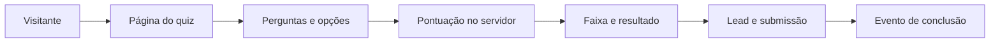
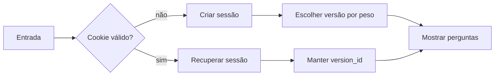
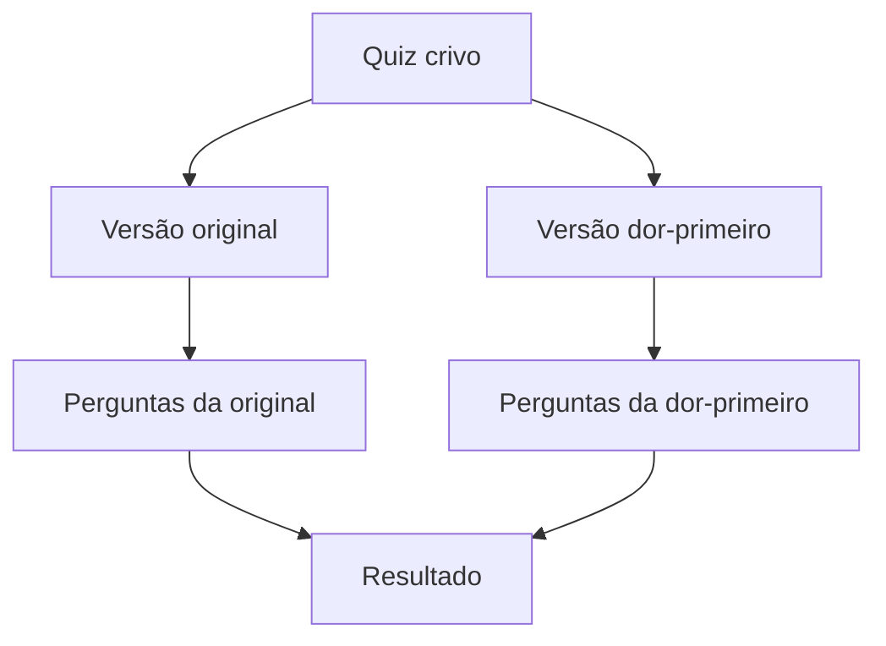
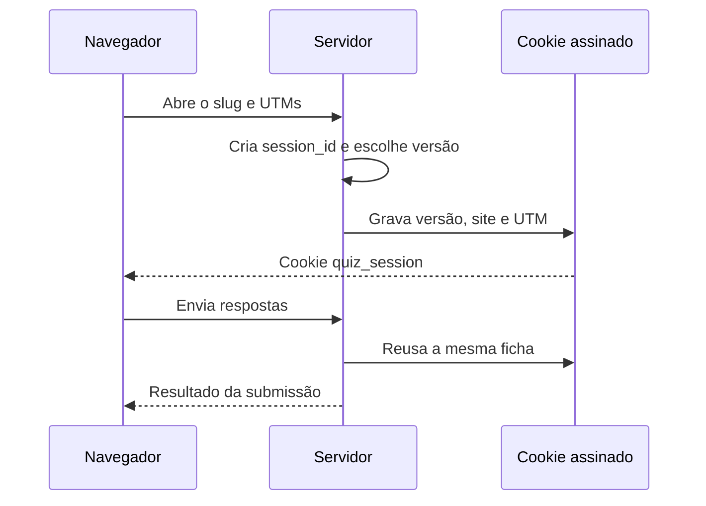
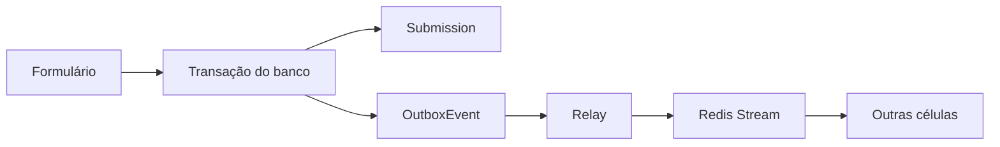
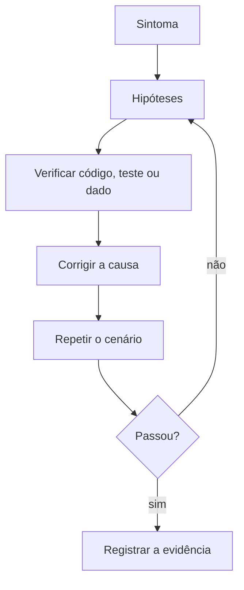

# Manual completo e didático para criar, publicar e operar um sistema de quizzes

Este manual explica o Crivo, a célula de quizzes deste projeto, para três pessoas:

- quem nunca criou um site e precisa operar um quiz;
- quem trabalha com campanhas e quer entender respostas, leads e origem;
- quem está começando em tecnologia e quer enxergar o que acontece nos bastidores.

Leia as etiquetas assim:

- **Confirmado no sistema**: está demonstrado no código, no teste ou no contrato citado.
- **Explicação simplificada**: é uma tradução didática de um comportamento confirmado.
- **Não identificado no código analisado**: não encontramos a capacidade ou a regra nas fontes examinadas. Não use essa frase como instrução.

O manual usa Ana como personagem fictícia. Ana representa uma operadora iniciante. A história ajuda a entender, mas as instruções reais sempre vencem a história.

## Antes de começar

### A resposta curta

Um quiz é uma página que apresenta perguntas, recebe escolhas, calcula uma pontuação no servidor, encontra uma faixa de resultado, registra uma submissão e pode encaminhar a pessoa para um próximo passo.

**Confirmado no sistema:** o Crivo expõe páginas HTML, não uma API JSON pública. A célula publica páginas em `/quiz/*` segundo [constituicoes/AGENTS.quiz.md](../../constituicoes/AGENTS.quiz.md) e as rotas reais estão em [services/quiz/config/urls.py](../../services/quiz/config/urls.py).

**Explicação simplificada:** pense em uma recepcionista. Ela faz perguntas, organiza as respostas, identifica o perfil da pessoa e entrega uma orientação. O Crivo faz isso com regras gravadas no banco.

### O que Ana quer fazer

Ana tem uma pequena empresa. Ela quer atrair visitantes, entender o perfil deles, mostrar um resultado, pedir um contato e comparar campanhas. Ela não quer que o visitante escolha a própria pontuação nem que a origem do anúncio desapareça no caminho.

O quiz ajuda a organizar esse atendimento. Ele não substitui uma equipe comercial, não cria automaticamente uma oferta e não prova sozinho que uma campanha vendeu.

### O mapa geral



**Pergunta de verificação:** em que momento a nota é calculada?

**Resposta:** depois que o servidor recebe as escolhas, nunca confiando em uma nota enviada pelo navegador.

## 1. O problema que o quiz resolve

Um formulário comum coleta campos. Um quiz coleta escolhas que podem ser comparadas com regras. Isso permite orientar a pessoa para um resultado diferente conforme suas respostas.

Imagine uma atendente que pergunta:

1. Qual é seu maior desafio?
2. Quanto tempo você tem?
3. Qual é sua experiência?

Com essas pistas, ela indica um próximo passo. O sistema transforma a conversa em dados: cada pergunta tem opções, cada opção tem pontos e cada intervalo de pontos corresponde a uma faixa.

### O que o quiz faz

**Confirmado no sistema:** o modelo tem `Quiz`, `QuizVersion`, `Question`, `Option`, `ResultBand`, `Submission`, `OutboxEvent` e `TelemetryEvent` em [models.py](../../services/quiz/apps/quiz/models.py).

**Explicação simplificada:** cada modelo é uma peça da ficha de atendimento. O quiz é a campanha, a versão é uma variação, a pergunta é uma etapa, a opção é uma escolha, a faixa é a classificação e a submissão é o registro final.

### O que o quiz não resolve sozinho

**Não identificado no código analisado:** painel administrativo para uma pessoa leiga criar e editar quizzes. A fonte observada fornece o comando de seed e o banco, mas não foi encontrada uma tela de administração do Crivo.

**Confirmado no sistema:** o Crivo não consome APIs de outras células. Sua constituição diz `Consome: nada`. Ele armazena o destino do botão como texto opaco e não sabe o que é checkout.

**Explicação simplificada:** o quiz pode apontar para um endereço que outra parte da plataforma entende. Ele não cria o produto, não cobra o cartão e não entrega o acesso.

### Exercício mental

Escolha uma empresa real e complete a frase: “Depois de responder, a pessoa precisa descobrir ______”. Se a resposta for uma oferta, uma aula ou uma conversa, isso é o próximo passo. Não transforme esse próximo passo em uma responsabilidade que o código do quiz não possui.

## 2. Vocabulário essencial

| Termo | Definição simples | Analogia | O que o sistema faz | Erro comum |
|---|---|---|---|---|
| Site | Um host atendido pelo quiz | Uma loja | Resolve o host para um `site_id` local | Usar o ID de outro site |
| Página | Endereço que o navegador abre | A porta da loja | Renderiza formulário ou resultado | Testar apenas a rota interna |
| Quiz | Campanha completa | O projeto da loja | Agrupa versões | Confundir com uma pergunta |
| Pergunta | Texto que pede uma escolha | Uma pergunta da atendente | Pertence a uma versão e tem ordem | Misturar perguntas de versões |
| Opção | Resposta possível | Uma resposta na ficha | Pertence a uma pergunta e tem pontos | Enviar um ID de outra pergunta |
| Resposta | Escolha feita pelo visitante | O que a pessoa disse | É guardada em `answers` | Mandar a pontuação no POST |
| Pontuação | Soma dos pontos das opções | Uma planilha de pontos | É calculada no servidor | Confiar no navegador |
| Faixa | Intervalo de pontuação | Uma categoria | Escolhe título, descrição e botão | Criar buracos ou sobreposição |
| Resultado | O que a faixa apresenta | A orientação da atendente | Mostra a faixa ligada à submissão | Achar que é uma venda |
| CTA | Botão do próximo passo | “Vá até este balcão” | Vem da faixa | Usar destino sem rótulo |
| Lead | Contato informado | A ficha da pessoa | Guarda e-mail e campos opcionais | Tratar como cliente pagante |
| Sessão | Identificação do atendimento | Uma senha de fila | Cookie assinado com UUID | Trocar de versão no meio |
| Versão | Variação do mesmo quiz | Outra vitrine | Tem perguntas, peso e faixas próprias | Editar a versão errada |
| Tráfego | Pessoas que chegam | Fluxo na calçada | Não é uma tabela própria nesta célula | Confundir visitas com leads |
| Campanha | Esforço para atrair pessoas | Uma ação de divulgação | É representada pelo quiz e UTMs | Achar que o quiz cria anúncios |
| UTM | Marcador na URL de origem | Etiqueta em uma encomenda | É capturada na entrada e preservada | Ler a UTM apenas na conclusão |
| Telemetria | Eventos de uso antes da submissão | Contador de passos | Registra visualização, clique e abandono | Tratar telemetria como lead |
| Banco de dados | Memória estruturada | Arquivo de fichas | Guarda configurações e submissões | Esperar que Redis seja o banco principal |
| Redis | Serviço de mensagens rápidas | Uma esteira | Recebe streams de telemetria e eventos | Assumir que ele substitui a submissão |
| Evento | Mensagem sobre algo ocorrido | Um aviso | Publica conclusão em formato definido | Inventar campos fora do contrato |
| Outbox | Registro pendente de entrega | Caixa de correspondência | Guarda o evento na transação local | Marcar como entregue antes de publicar |
| Relay | Processo que entrega eventos | Entregador | Publica pendências no stream | Achar que o navegador entrega o evento |
| Stream | Sequência de mensagens | Fila de cartas | Transporta mensagens no Redis | Confundir com tabela de respostas |
| Contrato | Formato combinado | Formulário padronizado | Define nome e campos do evento | Alterar o payload sem rito |
| JSON | Texto estruturado em chaves e valores | Formulário digital | Transporta metadados e contrato | Enviar texto fora do formato |
| Servidor | Processo que executa regras | A retaguarda da loja | Valida, soma e grava | Deixar decisão importante no cliente |
| Navegador | Programa do visitante | A pessoa diante do balcão | Exibe HTML e envia escolhas | Considerá-lo confiável |
| Worker | Processo que executa tarefas | Funcionário da retaguarda | Drena telemetria e roda o relay periódico | Rodar o site sem o worker e esperar entrega |

**Até aqui, pense assim:** a pessoa preenche uma ficha em uma loja.

**Na prática, o sistema faz isto:** o navegador envia escolhas; o Django valida, calcula e grava usando os modelos da célula quiz.

## 3. Como o visitante enxerga o quiz

### Passo 1. Chegada

Ana clica em um anúncio com uma URL como:

```text
https://exemplo/quiz/crivo/?utm_source=instagram&utm_medium=paid&utm_campaign=campanha_maio
```

**Confirmado no sistema:** a view aceita chaves que começam com `utm_`, limita cada valor a 200 caracteres, guarda no máximo oito chaves e salva os nomes sem o prefixo `utm_` em [views.py](../../services/quiz/apps/quiz/views.py).

**O que Ana vê:** a página do quiz.

**O que o sistema registra:** a UTM entra no cookie de sessão e depois na submissão.

**Se der errado:** um slug inexistente ou quiz inativo resulta em 404. Escolha um slug existente e ativo.

### Passo 2. Escolha da versão



**Confirmado no sistema:** versões ativas com peso maior que zero participam do corte. O código soma os pesos, usa o UUID da sessão para obter um ponto e percorre as versões ordenadas por ID. Isso está em `escolher_versao()`.

**Explicação simplificada:** não é um sorteio novo a cada clique. A sessão recebe uma versão e o cookie guarda essa escolha.

### Passo 3. Respostas

O formulário apresenta uma pergunta por etapa no navegador. O HTML usa campos `radio`, exige escolha para cada pergunta e depois mostra os campos de lead.

**Confirmado no sistema:** o template [formulario.html](../../services/quiz/apps/quiz/templates/quiz/formulario.html) mostra perguntas, opções, e-mail obrigatório, nome opcional e telefone opcional. O botão final diz “Ver resultado”.

**O que Ana vê:** uma pergunta, opções e o botão “Continuar”; no final, os dados de contato e “Ver resultado”.

**O que pode dar errado:** sem resposta, o servidor devolve status 422 e a mensagem “responda todas as perguntas”. Sem e-mail, devolve 422 e “e-mail é obrigatório”. Corrija o campo e envie novamente.

### Passo 4. Conclusão e resultado

Depois do POST, o servidor grava a submissão e redireciona para uma URL com `?lead=<UUID>`.

**Confirmado no sistema:** o resultado localiza a submissão pelo UUID, pelo quiz e pelo `site_id`. Um lead inválido ou de outro quiz resulta em 404.

**O que Ana vê:** título da faixa, descrição e, quando configurado, um botão.

**O que pode dar errado:** uma pontuação sem faixa gera `result_key = "sem_faixa"`; a tela pode não ter descrição nem botão. Corrija as faixas antes de publicar.

### Passo 5. Próximo passo

**Confirmado no sistema:** o botão é da `ResultBand`. Destino e rótulo são gravados juntos e a restrição do banco rejeita apenas um dos dois.

**Explicação simplificada:** uma pessoa iniciante e uma pessoa avançada podem receber convites diferentes. O quiz apenas apresenta o link plantado pelo operador.

**Não identificado no código analisado:** venda concluída, pagamento aprovado ou matrícula criada após o clique.

### Narrativa completa de Ana

Ana chega com uma UTM, recebe a versão original, responde às três perguntas, informa o e-mail e envia. O servidor soma os pontos, encontra a faixa “Você já tem base”, grava as respostas, grava a origem e apresenta o botão daquela faixa. Quando Ana clica, sai da responsabilidade do quiz.

**Perguntas de revisão:**

1. O botão aparece antes ou depois da faixa?
2. Quem decide o resultado?
3. O clique no CTA prova uma compra?

**Respostas:** depois da faixa; o servidor; não.

## 4. Como o quiz é montado

### A receita de cozinha

Pense em uma receita:

1. o quiz é o prato completo;
2. a versão é uma variação da receita;
3. cada pergunta é uma etapa;
4. cada opção é uma escolha de ingrediente;
5. os pontos são pesos;
6. a faixa é o resultado final;
7. o CTA é o próximo prato servido.

### Exemplo completo do seed existente

**Confirmado no sistema:** o comando [seed_quiz.py](../../services/quiz/apps/quiz/management/commands/seed_quiz.py) cria um quiz com slug configurável, três perguntas e três opções por pergunta.

| Pergunta | Opção | Pontos |
|---|---|---:|
| Qual é o seu maior desafio hoje? | Não sei por onde começar | 0 |
| Qual é o seu maior desafio hoje? | Já comecei mas travei no meio | 5 |
| Qual é o seu maior desafio hoje? | Quero acelerar o que já funciona | 10 |
| Quanto tempo você tem disponível por semana? | Menos de 2 horas | 0 |
| Quanto tempo você tem disponível por semana? | Entre 2 e 5 horas | 5 |
| Quanto tempo você tem disponível por semana? | Mais de 5 horas | 10 |
| Como você descreveria sua experiência atual? | Iniciante | 0 |
| Como você descreveria sua experiência atual? | Intermediário | 5 |
| Como você descreveria sua experiência atual? | Avançado | 10 |

As faixas do seed são:

| Faixa | Pontuação | Rótulo do botão |
|---|---:|---|
| Você está começando | 0 a 9 | Começar pelo básico |
| Você já tem base | 10 a 19 | Destravar o próximo passo |
| Você está pronto para escalar | 20 a 30 | Quero escalar agora |

O destino do botão é argumento obrigatório do comando. O seed não fixa uma oferta porque o Crivo não conhece checkout.

### Pontuação linha por linha

Se Ana escolhe 5, 10 e 0:

```text
Pergunta 1: 5 pontos
Pergunta 2: 10 pontos
Pergunta 3: 0 pontos
Total: 5 + 10 + 0 = 15
Faixa encontrada: 10 a 19
Resultado: Você já tem base
```

### Por que o navegador não pode decidir a nota?

**Até aqui, pense assim:** o aluno entrega respostas e o professor corrige.

**Na prática, o sistema faz isto:** o navegador envia somente `option_id` por pergunta. O servidor procura a opção pertencente àquela pergunta e soma `Option.points`. Se o ID não pertencer à pergunta, a view retorna 404.

O navegador é útil para mostrar a tela, mas não é autoridade para nota, faixa ou submissão. Alterar HTML ou JavaScript não deve alterar a pontuação oficial.

## 5. Versões e divisão de tráfego

### Duas vitrines para a mesma loja



**Confirmado no sistema:** uma `QuizVersion` tem `key`, `weight` e `active`; perguntas e faixas pertencem à versão. O seed aceita `--variacao` com JSON próprio.

**Explicação simplificada:** Ana pode testar duas vitrines sem criar dois quizzes independentes.

| Versão | Descrição | Peso | Expectativa |
|---|---|---:|---:|
| original | Texto atual | 70 | Cerca de 70% |
| dor-primeiro | Aborda o problema antes | 30 | Cerca de 30% |

A expectativa não é uma garantia exata para poucas visitas. O corte usa o UUID da sessão, não o navegador escolhendo uma opção.

### Editar ou criar outra versão

Edite a versão existente quando a identidade da experiência não precisa ser comparada com uma anterior. Crie outra versão quando a pergunta, a promessa ou a estrutura que você quer medir deve continuar separada.

**Não identificado no código analisado:** uma interface visual para fazer essa edição. O caminho confirmado é o comando de seed e seus argumentos.

### O que ainda não pode ser prometido

**Confirmado no sistema:** a versão é preservada na sessão, na telemetria e na submissão.

**Não identificado no contrato de conclusão analisado:** `version_key` dentro de `quiz.completado.v1`. O contrato exige `site_id`, `quiz_slug`, `result_key`, `score` e `lead`, mas não exige a versão. Portanto, não instrua alguém a comparar versões usando esse evento como se a versão estivesse garantida no payload. Para analisar versões, use as submissões ou a telemetria enquanto essa fonte estiver acessível.

## 6. Sessão estável e continuidade

### A ficha de atendimento



**Confirmado no sistema:** o cookie se chama `quiz_session`, é assinado pelo Django, dura sete dias, é `HttpOnly`, usa `SameSite=Lax` e guarda `session_id`, `version_id`, `version_key`, `site_id` e UTM por slug.

Se Ana atualizar a página, o cookie válido mantém a versão. Se fechar e voltar dentro do prazo, o sistema tenta reutilizar a mesma ficha. Se a assinatura for inválida, o cookie é ignorado e uma nova sessão pode ser criada.

**Explicação simplificada:** a sessão é uma senha de atendimento. Ela evita misturar respostas da vitrine A com a vitrine B.

**Pergunta de verificação:** o que acontece se a versão salva ficar inexistente ou inválida? O sistema resolve uma nova versão para aquela sessão, porque a versão recuperada deixa de ser utilizável.

## 7. Perguntas, respostas e pontuação

### O caminho confiável

1. A versão determina quais perguntas existem.
2. As perguntas são ordenadas por `order`.
3. Cada pergunta determina suas opções.
4. Cada opção tem `points` no banco.
5. O POST envia a escolha de cada pergunta.
6. O servidor busca a opção dentro da pergunta.
7. O servidor soma os pontos.
8. A soma encontra uma faixa.

### Entrada inválida

| Situação | Resposta do sistema | Ação do operador |
|---|---|---|
| E-mail vazio | 422 e mensagem de e-mail obrigatório | Preencher o e-mail |
| Pergunta sem escolha | 422 e mensagem para responder tudo | Escolher uma opção |
| Opção de outra pergunta | 404 | Corrigir o formulário ou a tentativa de adulteração |
| Quiz ou site inexistente | 404 | Conferir host, slug e seed |
| Nenhuma versão ativa | 404 | Ativar uma versão com peso maior que zero |
| Lead inválido na URL | 404 | Abrir o resultado por um link gerado pelo sistema |
| Pontuação sem faixa | Resultado com `sem_faixa` | Corrigir intervalos antes de publicar |

Uma opção inválida não deve ser “consertada” aceitando qualquer ID. O vínculo entre pergunta e opção é uma barreira contra respostas adulteradas.

## 8. Faixas de resultado e CTA

### Faixa como régua

Uma faixa tem `min_score`, `max_score`, `key`, título, descrição e campos do botão. O servidor busca a faixa cujo mínimo é menor ou igual à pontuação e cujo máximo é maior ou igual.

```text
0 ----- 10 ----- 20 ----- 30
| baixo | médio | alto   |
0 a 9   10 a 19 20 a 30
```

**Até aqui, pense assim:** uma régua classifica a pontuação.

**Na prática, o sistema faz isto:** `ResultBand` converte a soma em `result_key` e a tela usa essa faixa para mostrar descrição e botão.

Faixas sobrepostas podem fazer a primeira faixa encontrada vencer de modo inesperado. Faixas com buracos produzem `sem_faixa`. Antes de publicar, confira mínimo, máximo e fronteiras.

### Resultado não é venda

O resultado é uma classificação explicada. O CTA é um endereço e um rótulo. **Não identificado no código analisado:** prova de que o visitante clicou, comprou ou foi matriculado.

## 9. Captura de lead

### O cadastro

O template apresenta e-mail obrigatório, nome opcional e telefone opcional. A submissão guarda ainda quiz, versão, site, pontuação, faixa, respostas, UTM e data.

**Confirmado no sistema:** o evento de conclusão leva o e-mail e inclui nome e telefone somente quando foram informados. Leva também site, slug, faixa, score e UTM conforme o payload produzido em `views.formulario`.

**Não identificado no código analisado:** política de privacidade, consentimento jurídico ou prazo de retenção específico desta célula. Não invente uma regra legal a partir deste manual.

### Cuidado operacional

Um lead é um contato capturado. Não diga que ele é cliente, comprador ou pessoa consentida para qualquer uso. Use os dados apenas conforme as políticas reais do produto e as capacidades reais das outras células.

## 10. UTMs e campanhas

### A etiqueta na encomenda

```text
?utm_source=instagram&utm_medium=paid&utm_campaign=campanha_maio
```

**Confirmado no sistema:** o Crivo lê chaves com prefixo `utm_`, remove esse prefixo ao guardar e associa a origem ao cookie da sessão. Uma chegada posterior sem UTM não substitui uma UTM já guardada.

**Explicação simplificada:** a etiqueta acompanha a ficha de atendimento. Ela ajuda a perguntar “de onde veio esta pessoa?”.

UTM não prova sozinha que o anúncio causou a compra. Ela identifica a origem declarada na URL que chegou ao quiz. A análise de campanha precisa combinar origem, versão, submissões e a prova real de conversão, caso exista em outra célula.

## 11. O que acontece nos bastidores

### Submissão e outbox



**Confirmado no sistema:** a submissão e o `OutboxEvent` são criados na mesma transação. Depois do commit, o código agenda o relay. Existe também uma tarefa periódica de segurança a cada minuto.

**Até aqui, pense assim:** primeiro coloque a carta na caixa de correspondência; depois um entregador tenta levá-la.

**Na prática, o sistema faz isto:** registra o evento antes da entrega externa. O relay publica antes de marcar `published_at`. Se a publicação falhar, o evento continua pendente e pode ser tentado novamente.

### Contrato de evento

O contrato é um formulário padronizado. Ele exige o envelope `event`, `version`, `event_id`, `occurred_at` e `data`. Dentro de `data`, exige `site_id`, `quiz_slug`, `result_key`, `score` e `lead`.

**Importante:** o contrato observado não inclui `version_key` na conclusão. A telemetria inclui versão, mas o evento `quiz.completado.v1` não garante esse campo.

### Telemetria

O navegador emite `view_quiz`, `view_question`, `click_option` e `abandon`. O endpoint exige POST, valida tamanho, JSON, cookie de sessão, tipo de evento e metadados. O Redis recebe o envelope e uma tarefa drena o stream para `TelemetryEvent`.

Telemetria é descartável e não substitui a submissão. Se Redis perder o stream, a submissão completa continua no banco.

## 12. Separação entre componentes

```text
+------------------- Navegador -------------------+
| HTML, escolhas, JavaScript de passos e telemetria|
+-------------------------+------------------------+
                          |
                          v
+------------------- Célula quiz ------------------+
| Django, regras, sessão, pontuação e submissão    |
+-----------+------------------+------------------+
            |                  |
            v                  v
      Banco quiz          Redis Streams
      configurações       eventos rápidos
      e submissões              |
                               v
                       Outras células consumidoras

Checkout e pagamentos ficam fora do quiz. O CTA pode apontar para eles,
mas o Crivo não cria pedido nem confirma pagamento.
```

**Confirmado no sistema:** a constituição da célula proíbe acesso ao banco de outra célula e diz que o quiz não consome API de outra célula. O destino do botão é opaco.

## 13. Como publicar e testar

### O comando confirmado

O comando de seed exige host, site ID, nome do site e destino do botão:

```text
python manage.py seed_quiz --host exemplo.com --site-id site-exemplo --site-name "Exemplo" --slug crivo --destino-do-botao /checkout/curso-teste/
```

No PowerShell, use uma única linha ou o acento grave para continuação, conforme o ambiente. **Confirme o comando real no diretório `services/quiz` antes de executar**, porque a operação depende do ambiente Django e do banco da célula.

**Confirmado no sistema:** o seed é idempotente, cria ou atualiza dados fixos e pode receber `--variacao` para uma versão extra. Ele recusa slugs que conflitam com caminhos reservados.

**Não identificado no código analisado:** um botão de painel web para publicar. O processo confirmado é o comando de gerenciamento e a infraestrutura de deploy do projeto.

### Testes locais da célula

```text
cd services/quiz
python -m pytest -q
```

O Makefile também define:

```text
make ci
```

Esse alvo executa lint, tipagem quando configurada, testes e verificação de contrato. Rode a suíte no ambiente preparado da célula. Não declare publicação apenas porque o teste local passou.

### Teste de ponta a ponta para Ana

1. Abra o host correto.
2. Abra o slug sem e com UTM.
3. Confirme que as perguntas aparecem.
4. Recarregue e confirme que a versão não muda.
5. Tente enviar sem e-mail.
6. Tente enviar sem uma resposta.
7. Envie um caso válido.
8. Confirme o resultado e o botão da faixa.
9. Verifique a submissão e o evento conforme o acesso operacional permitido.

## 14. Diagnóstico de problemas



| Sintoma | Verificação | Correção segura |
|---|---|---|
| 404 no quiz | Host, slug, ativo e `site_id` | Corrigir seed e caminho |
| 404 em `/healthz` ou `/static/` | Caminho isento do middleware | Não criar quiz com slug reservado |
| Versão muda no meio | Cookie, `version_id` e validade | Preservar a sessão e conferir versões ativas |
| Resultado sem botão | Faixa sem destino ou rótulo | Rodar seed com destino e rótulo coerentes |
| `sem_faixa` | Intervalos e score máximo | Cobrir toda a faixa possível |
| E-mail recusado | Campo obrigatório e CSRF | Corrigir formulário e token |
| Telemetria 401 | Cookie ausente ou inválido | Reabrir a página do quiz e tentar de novo |
| Telemetria 503 | Redis indisponível | Verificar Redis e worker; o lead válido continua no banco |
| Evento não aparece | Outbox pendente ou relay parado | Verificar worker e tarefa periódica |
| UTM desaparece | Cookie ou chegada inicial sem UTM | Testar a primeira URL com os parâmetros corretos |

### Quatro perguntas antes de mudar código

1. O sintoma ocorre na borda pública ou apenas em teste interno?
2. O dado foi gravado no banco?
3. O evento ficou na outbox?
4. A falha é do quiz ou de quem deveria consumir o evento?

## 15. Exercícios práticos

### Exercício 1. Desenhe a recepção

Desenhe cinco caixas: entrada, perguntas, pontuação, resultado e próximo passo. Em cada caixa, escreva uma entrada e uma saída.

### Exercício 2. Confira um caso

Use três perguntas com pontos 0, 5 e 10. Escolha uma opção de cada e calcule a soma manualmente. Depois diga em qual faixa ela cai.

### Exercício 3. Teste a sessão

Abra o quiz com `utm_source=instagram`, atualize a página e depois abra sem UTM. A origem esperada continua sendo a primeira, enquanto a sessão for válida.

### Exercício 4. Encontre o buraco

Crie faixas 0 a 9 e 11 a 20. O que acontece com 10? A resposta correta é `sem_faixa`. O exercício mostra por que fronteiras precisam ser conferidas.

### Exercício 5. Separe fato de explicação

Pegue uma frase do manual e localize a fonte. Se não encontrar fonte em código, teste ou contrato, troque por “Não identificado no código analisado”.

## 16. Checklist da operadora

- [ ] O host pertence ao site correto.
- [ ] O `site_id` local foi informado corretamente no seed.
- [ ] O slug não conflita com caminho reservado.
- [ ] Existe pelo menos uma versão ativa com peso maior que zero.
- [ ] Todas as perguntas têm opções.
- [ ] Os pontos das opções foram revisados.
- [ ] As faixas cobrem a pontuação possível sem sobreposição.
- [ ] Cada botão tem destino e rótulo juntos.
- [ ] O destino do botão foi escolhido para aquele site.
- [ ] O formulário exige e-mail e respostas.
- [ ] O teste com UTM preserva a origem.
- [ ] O teste de atualização mantém a versão.
- [ ] O resultado real aparece para um lead de teste.
- [ ] A submissão está no banco autorizado para consulta.
- [ ] Outbox e relay foram verificados quando a operação exige eventos.

## 17. Fontes conferidas

- [Constituição da célula quiz](../../constituicoes/AGENTS.quiz.md)
- [Modelos do quiz](../../services/quiz/apps/quiz/models.py)
- [Views do quiz](../../services/quiz/apps/quiz/views.py)
- [Relay e telemetria](../../services/quiz/apps/quiz/tasks.py)
- [Comando de seed](../../services/quiz/apps/quiz/management/commands/seed_quiz.py)
- [Formulário](../../services/quiz/apps/quiz/templates/quiz/formulario.html)
- [Resultado](../../services/quiz/apps/quiz/templates/quiz/resultado.html)
- [Contrato `quiz.completado.v1`](../../contracts/eventos/quiz.completado.v1.json)
- [Testes de telemetria](../../services/quiz/tests/test_telemetria.py)
- [Testes de superfície pública](../../services/quiz/tests/test_superficie_publica.py)
- [Testes de pontuação e outbox](../../services/quiz/tests/test_inv_pontuacao_servidor_e_outbox.py)
- [Lições da célula](../../services/quiz/LICOES.md)

### Veredito para Ana

Ana agora consegue explicar o caminho inteiro sem atribuir ao quiz o que pertence a outra célula: a pessoa chega, recebe uma versão estável, responde, tem a pontuação calculada pelo servidor, recebe uma faixa, informa o contato, vê o CTA e deixa um evento pendente de entrega confiável. Onde o código não comprova um painel, uma regra legal, uma comparação de versões no evento ou uma venda, o manual diz isso explicitamente.
